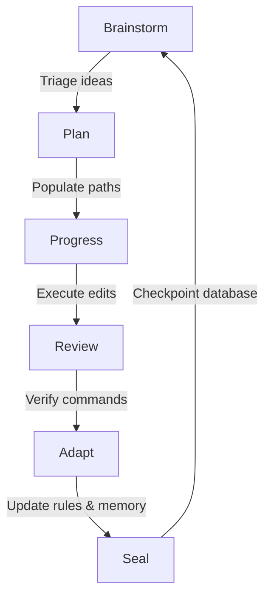

# progress-review-plan (PRP Doctrine)

Durably track backlog task state across sessions. State lives in JSON files under
`artifacts/developer/`, not in chat memory — a fresh agent invocation inherits exact
historical status by reading these files, not by trusting a prior turn's summary.

## Core philosophy

- **Non-volatile state.** LLM context windows are volatile; the roadmap and verification
  states are persisted in `artifacts/developer/` so any fresh session inherits them exactly.
- **Verification-first engineering.** Never claim code "works" or is "correct" from opinion.
  Every completed item needs a command-execution receipt: "ran X, got Y."
- **Dynamic adaptation.** Failures and rule violations found during review are captured and
  proposed back into skills/`AGENTS.md` via `adapt.json`, so the same mistake doesn't repeat.

## State Files & JSON Schema (v3)

Four files under `artifacts/developer/`:
- `plans.json` — untriaged work, ideas, brainstorm entries, and checkpoints (written by Seal).
- `progress.json` — live backlog of open and in-progress tracked work.
- `review.json` — actioned-but-not-yet-verified work queue (trends toward empty).
- `adapt.json` — proposed tweaks to agent skills, rules, or memory systems.

### Schema Fields Reference

#### 1. `plans.json`
* **`schema_version`** (int): 3
* **`description`** (str): Baseline roadmap description.
* **`brainstorm`** (array): `idea` (str), `status` (`triaged` | `brainstorm`).
* **`checkpoints`** (array): `timestamp` (ISO-8601), `tag`, `status` (`verified` | `completed`),
  `evidence` (text confirming successful loop outputs).
* **`items`** (array): `title`, `description`, `priority` (`high`|`medium`|`low`),
  `status` (`planned`|`in-progress`|`completed`), `progress_targets` (paths tracked in
  `progress.json`).

#### 2. `progress.json`
* **`schema_version`** (int): 3
* **`description`**, **`last_updated`** (YYYY-MM-DD)
* **`entries`**: `filename`, `path` (primary key), `purpose`, `score` (0-100, 100 = done and
  verified), `status` (`in-progress`|`done`), `last_verified` (YYYY-MM-DD), `evidence`
  (command run + output verification receipt).

#### 3. `review.json`
* **`schema_version`** (int): 3
* **`description`**
* **`entries`**: `filename`, `path`, `score` (`unreviewed` | 0-100), `verdict`
  (`NOT REVIEWED`|`ACCEPTED`|`ACCEPTED WITH CAVEATS`|`NOT ACCEPTED`), `issues`, `review_command`,
  `evidence`. A `score` of `"unreviewed"` must never be paired with an ACCEPTED-tier verdict —
  that combination is a structural contradiction and a sign the row was auto-stamped without a
  real pass.

#### 4. `adapt.json`
* **`schema_version`** (int): 3
* **`proposed_tweaks`**: `target` (path of rules/skills file to update), `change` (plain-text
  rule modification), `status` (`proposed`|`applied`), `evidence` (commit or file-edit receipt
  verifying the rule was actually applied — not just proposed), `use_count` (int, how many times
  the rule has been referenced or successfully applied), `rating` (float 0.0-10.0, upvoted or
  downvoted based on the rule's observed effectiveness at preventing regressions).

---

## Phased Lifecycle Actions

Execute only **one** action type per turn — do not mix implementation with verification in the
same pass.

1. **`Proceed-with-Brainstorm`** — discuss/capture new ideas or re-audits. Write conclusions
   **only** to `plans.json`'s `brainstorm[]`. No implementation file paths touched.
2. **`Proceed-with-Plan`** — read `plans.json`, break milestones into concrete files, populate
   `progress.json`/`review.json` with target paths, descriptions, and validation commands.
3. **`Proceed-with-Progress`** — modify target files to hit the milestone. Update
   `progress.json` status for modified targets.
4. **`Proceed-with-Review`** — run the exact `review_command` from `review.json`, capture output
   and exit code, assign verdict/score. **See Scoring Guidelines below — exit code 0 alone caps
   at ACCEPTED WITH CAVEATS, never ACCEPTED.**
5. **`Proceed-with-Adapt`** — scan verification errors, write learning rules/tweaks to
   `adapt.json`, and modify `AGENTS.md`/`.agents/skills/*` to hardcode constraints against
   repeating those errors. Increment `use_count` and adjust `rating` (upvote/downvote) each time
   a rule is referenced or applied, to prune low-performing constraints over time.
6. **`Proceed-with-Inspect`** — runnable any time; verifies the tables are structurally in sync
   (same row/key set) and reconciles discrepancies. Log every auto-fix made — no silent repair.
7. **`Proceed-with-Seal`** — checkpoints the database. Only valid once `review.json` has been
   cleared **and every remaining score is a genuine 100** (not exit-code-capped 85s). If a
   checkpoint is sealed while `review.json` is non-empty or scores are capped, that is a doctrine
   violation — flag it rather than treating the checkpoint as a clean state.



## Scoring Guidelines (revised — capped auto-verify)

* **`100` (`ACCEPTED`)** — fully implemented, fully documented, passed `review_command` with a
  clean trace, **and** a separate content-reading pass (human, or an agent that actually reads
  the code/output producing each reported number) confirmed the result isn't fabricated,
  mocked, or an RNG draw dressed as real output. Exit code 0 alone is necessary but not
  sufficient.
* **`85–90` (`ACCEPTED WITH CAVEATS`)** — implementation runs successfully (exit code 0) but
  either carries minor structural caveats/unhandled domain assumptions, **or** has only been
  auto-verified by the `--action verify` script and has not yet had its content independently
  read. This is the automated verify loop's ceiling — it cannot self-promote a row to 100.
* **`50–70` (`NOT ACCEPTED`)** — implementation partial, or `review_command` failed at
  execution time.
* **`unreviewed` / `<50` (`NOT REVIEWED`)** — stub, or `review_command` never executed.

**Why the cap exists:** `.agents/AGENTS.md` footgun #11 — `suite_06`/`suite_07` scored 97-100 for
months on exit-code success alone while containing 100% fabricated output (hardcoded literals,
`np.random`-simulated trajectories). "Executes without error" is not verification of content.
The automated verify script (`scripts/self_supervised_prp.py --action verify`) now stamps exit
code 0 as `ACCEPTED WITH CAVEATS` / score 85, never `ACCEPTED` / 100 — promotion to 100 requires
a distinct pass that actually reads the code producing the reported numbers.

---

## Automated Supervisor: `scripts/self_supervised_prp.py`

### 1. Reconcile Registries (`--action sync`)
Reconciles paths between progress and review tables to prevent sync drift:
```bash
python scripts/self_supervised_prp.py --action sync
```

### 2. Self-Supervised Review Loop (`--action verify`)
Finds open entries in `review.json`, executes their `review_command` in a background subprocess,
captures stdout/stderr, and on exit code 0 sets `score = 85` / `verdict = ACCEPTED WITH CAVEATS`
(capped — see Scoring Guidelines), logging the execution trace as `evidence`. On nonzero exit,
sets `score = 50` / `verdict = NOT ACCEPTED`. Never assigns `ACCEPTED`/100 itself.
```bash
python scripts/self_supervised_prp.py --action verify
```

To force re-verification of already-verified rows (e.g. after an environment or library change),
append `--force` — this bypasses the stored skip condition for both `ACCEPTED` and
`ACCEPTED WITH CAVEATS` rows:
```bash
python scripts/self_supervised_prp.py --action verify --force
```

### 3. Self-Evolving Adaptation Loop (`--action adapt`)
Scans verification error trace logs (e.g. `NameError`, path issues) and formats new proposed
rules inside `adapt.json`. Every time a rule is referenced or applied in a task, increment its
`use_count` and adjust `rating` (upvote/downvote) to prune low-performing constraints over time.
```bash
python scripts/self_supervised_prp.py --action adapt
```

### 4. Checkpoint State (`Seal`)
Saves a checkpoint of the current JSON database once `review.json` has been cleared and no
entries remain at the exit-code-capped 85 tier.
