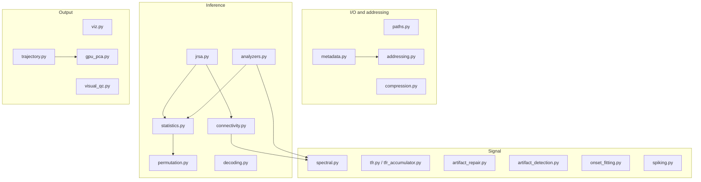
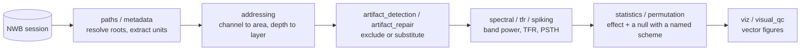

# `jnwb`

Dataset-agnostic Python library for NWB (Neurodata Without Borders) electrophysiology analysis:
session I/O, addressing (channel→area, depth→layer), representational similarity analysis (JRSA),
TFR accumulation/compression, generic statistics, and visual QC.

`jnwb` makes no assumptions about task structure, condition codes, or experiment design. For a
worked example of building a full project on top of it — including a task-specific extension
package, scripts, notebooks, and a manuscript pipeline — see [`omission/`](omission/README.md),
this repo's native large-dataset example project.

---

## What it does, in one figure

```bash
python examples/quickstart_jnwb.py     # writes examples/figures/jnwb_quickstart.{svg,png}
```


Six library primitives, each run on a **simulated** signal whose ground truth is known, so every
panel shows what the function recovered next to what it should have recovered. That makes the
script a smoke test as well as a demo: if a panel stops matching its ground truth, something in
the library moved. Nothing on that figure is an empirical result about any recording — real
results live in [`omission/`](omission/README.md).

The fourth panel is the one worth pausing on. It is not a feature demo; it is a bug that shipped
here once. A null built by shuffling labels globally, when the labels are constant within a
group, produces a distribution that looks significant against an observed value that is nothing
of the kind. `permute_labels` therefore has **no default** for `scheme` — every call must name
its exchangeability assumption out loud.

## How the pieces fit

Layering is one-directional and shallow: 17 of the 24 modules are leaves that import nothing else
in the package, and the deepest chain is three modules long. That is deliberate — it is what lets
a project depend on one corner of the library without pulling in the rest.



A typical analysis runs left to right across those groups:



---

## Install

```bash
pip install -e ".[test]"
```

## Paths — do this first after any drive remap

Repo-internal paths (`REPO_ROOT`, `outputs_dir()`, `artifacts_dir()`) resolve from the package's
own location and always work. External data roots live on a separate volume and are set by
environment variable — see [`jnwb/paths.py`](jnwb/paths.py) for the full list and defaults.

```python
import jnwb
jnwb.paths.describe()   # every root + whether it currently resolves
```

If a root shows `exists: false`, set its env var — do not edit source, and do not write a new
absolute literal into a script.

---

## Quick start

```python
import jnwb

result = jnwb.jrsa(x1, x2, metric='rsa', stats=True)
result.summary()
result.plot()
```

Null construction under an explicit exchangeability scheme — every call must name `scheme`
(`"within_group"` or `"global"`), there is no default, since a bare `rng.permutation(y)` inside
grouped/session-structured decoding is a documented past bug (see `jnwb/permutation.py`):

```python
import numpy as np
rng = np.random.default_rng(0)
null_labels = jnwb.permute_labels(labels, groups=cycle_id, scheme="within_group", rng=rng)
```

Trial-segmented LFP/TFR artifact detection-and-substitution (cross-channel-synchrony detection,
cross-trial-median repair; see `jnwb/artifact_repair.py`):

```python
repaired, frac_flagged, diagnostics = jnwb.repair_lfp_trials(
    segments, times_ms=times_ms, z_thresh=6.0)          # segments: (n_trials, n_channels, n_times)
repaired_power, frac_flagged_by_band = jnwb.repair_band_artifacts(power, freqs)  # per-band TFR
```

Causal PSTH smoothing and causality-bounded exponential onset-latency fit (a forward-only
kernel by design — an acausal/centered smoother would let post-onset activity bias the fitted
onset earlier than the true rise; see `jnwb/onset_fitting.py`):

```python
smoothed = jnwb.causal_exp_smooth(rate, bin_ms=5.0, tau_ms=30.0)
fit = jnwb.fit_exponential_onset(t_ms, smoothed, t0_bounds=(0.0, None))  # fit["t0"], ["tau"], ["r2"]
```

Unit/electrode metadata extraction, QC classification, and census reporting, from a plain list
of NWB paths:

```python
units = jnwb.get_all_units_metadata(nwb_paths)          # -> DataFrame, one row per unit
units = jnwb.classify_unit_quality(units)                # + quality_class, is_valid, issue_flags
census = jnwb.unit_census_report(units, group_by=["area"])
snr_stats = jnwb.get_snr_analysis(units)                 # -> {'pass_rate': ..., 'snr_mean': ...}
good_v1 = jnwb.filter_by_criteria(units, {"area": "V1", "firing_rate": (1.0, 50.0)})
unit_audit = jnwb.audit_units(units)             # spike-time coverage, quality/SNR/rate stats
elec_audit = jnwb.audit_electrodes(electrodes, units)  # area counts, unit-assignment rate
tier = jnwb.assign_quality_tier(units["quality"], units["trial_presence_fraction"], units["snr"])
diff = jnwb.compare_old_new_criteria(new_units, old_units)  # gained/lost/unchanged transitions
```

Generic paired fire-probability testing — plain spike-time/onset arrays and boolean pairs in,
a shuffle-null p-value + bootstrap CI + odds ratio out (`jnwb/statistics.py`):

```python
fired = jnwb.fire_indicator(spike_times, onsets, window_ms=(0.0, 150.0))
result = jnwb.paired_fire_prob_test(fired_target, fired_baseline, n_shuffles=2000, n_bootstrap=2000, rng=rng)
```

Generic spike-rate windowing, shuffle-controlled paired/unpaired p-values, temporal
cycle/quantile detection on a trial table, and a shuffle-null R² CI (`jnwb/statistics.py`):

```python
rate_hz = jnwb.rate_in_window(spike_times, onset_s, window_ms=(0.0, 200.0))
obs, p = jnwb.shuffle_pvalue_paired(a, b, n_shuffles=2000, rng=rng, alternative="greater")
cycle_id = jnwb.detect_trial_cycles(trials, gap_factor=10.0)     # trials: DataFrame with start_time
r2 = jnwb.shuffle_r2_ci(y_true, y_score, groups=cycle_id, n_shuffle=500)
result = jnwb.cross_modal_comparison(tfr_data, spike_data)       # trial-averaged zero-lag correlation
result = jnwb.cross_modal_comparison(tfr_data, spike_data, lag_range_ms=(-200, 200), bin_ms=10.0)
# ^ with bin_ms given, searches lag_range_ms for the best-correlating shift instead of zero-lag only
```

Generic spectral analysis — band-limited power, cross-area coherence, 1/f tilt, imaginary
coherency (immune to zero-lag volume-conduction mixing by construction), and bipolar/Laplacian
re-referencing (`jnwb/spectral.py`; `CANONICAL_BANDS` is the single-source-of-truth band-edge
default, theta/alpha/beta/low_gamma/high_gamma):

```python
coh = jnwb.cross_area_coherence(v1_lfp, pfc_lfp, sampling_rate=1000.0)
theta_power_db = jnwb.band_power(lfp, 1000.0, jnwb.CANONICAL_BANDS["theta"], baseline=baseline_lfp)
icoh = jnwb.imaginary_coherency(x, y, sampling_rate=1000.0, freq_range=(1, 100))  # icoh_mean, coh_mag_mean
laplacian = jnwb.laplacian_reference(channel_data, channel_order=depth_order)
freqs, psd = jnwb.compute_psd(lfp_data, fs=1000.0)   # plain Welch PSD wrapper
```

Modality-agnostic directed functional connectivity — Granger causality, spectral (Geweke)
Granger, phase slope index, and transfer entropy all share one `(X, Y, ...)` contract and
return the same `DirectedResult` shape, so LFP traces, binned spike counts, MUAe envelopes, and
band-power time courses go through identical code (`jnwb/connectivity.py`):

```python
rate_a = jnwb.bin_spikes(spike_times_a, window=(-0.5, 1.0), bin_size_ms=10.0, output="rate")
result = jnwb.granger(v1_lfp, pfc_lfp, order="auto")        # or jnwb.phase_slope_index(..., fs=1000.0)
print(result.x_to_y, result.y_to_x, result.net)              # DirectedResult: uniform across estimators
network = jnwb.directed_network({"V1": v1_lfp, "PFC": pfc_lfp}, method="granger")
```

Generic nested cross-validated linear-SVM population decoding — plain `(n_trials, n_features)`
matrix and integer labels in, accuracy/F1/AUC/majority-baseline out, NaN (never fabricated)
under degenerate class counts (`jnwb/decoding.py`):

```python
result = jnwb.nested_cv_linear_svm(X, labels, n_splits=5)
print(result["accuracy"], result["f1"], result["auc"], result["majority_baseline_accuracy"])
```

Generic grouped leave-one-group-out CV geometry, representation contracts (R0/R1/R2), and a
reproducible within-group null-permutation plan — plain trial `DataFrame`/array in, no session
or condition semantics (`jnwb/decoding.py`, `jnwb/permutation.py`):

```python
outer = jnwb.assign_outer_folds(trials, analysis_cols=("session", "analysis", "slot_key"), group_col="cycle")
inner = jnwb.build_inner_validation_partitions(outer)
ladder = jnwb.build_representation_ladder(raster, modality="SPK")   # X_rate, X_vec, X_structured
plan = jnwb.build_permutation_plan(labels, groups, n_permutations=1000, seed=0)  # draw_manifest
```

Generic spike-response metrics — firing rate/latency/z-score relative to any behavioral epoch,
significance classification, and spike-LFP phase locking (`jnwb/spiking.py`):

```python
metrics = jnwb.compute_response_metrics(spike_times, epoch_onsets, response_window=(0.0, 0.15))
sig = jnwb.classify_response_significance(metrics)             # is_significant, pvalue, confidence
pli = jnwb.phase_locking_index(spike_times, lfp_phase, lfp_timestamps)  # pli, rayleigh_pvalue
```

Generic plotting utilities — vector-graphics setup, tight auto-scaled axes, multi-page/format
figure export, trial-onset resampling, and array-in PSTH (`jnwb/viz.py`):

```python
jnwb.setup_vector_graphics()                                    # editable SVG fonts
centers, mean_hz, sem_hz = jnwb.raster_psth(spike_times, onsets, win_ms=(-500, 1000))
jnwb.save_figure_suite(figures, "outputs/figures", basename="raster", formats=["png", "pdf"])
```

---

## Module map

The public surface is `jnwb/__init__.py` (`__all__`).

| Module | Role |
|---|---|
| `paths.py` | Repo and data root resolution; the only place absolute paths live |
| `addressing.py` | Peak-channel → area mapping, depth → layer classification |
| `ontology.py`, `jrsa.py` | `Dataset`/`AlignedDataset`/`Question`/`Result` objects; unified RSA engine |
| `statistics.py`, `analyzers.py` | `StatisticalAnalysis`, `TFRAnalyzer`, `UnitAnalyzer`, `PopulationAnalyzer` |
| `tfr_accumulator.py`, `compression.py` | Poolable TFR summary statistics; NWB fp32 compression |
| `trajectory.py`, `gpu_pca.py` | Population trajectories via GPU SVD |
| `visual_qc.py` | Generic visual QC plotting |
| `bilinear.py`, `nam.py`, `permutation.py` | Generic modeling/statistical primitives |
| `artifact_repair.py`, `artifact_detection.py` | Trial-segmented artifact repair (substitution) / detection (exclusion) |
| `onset_fitting.py` | Causal PSTH smoothing; causality-bounded exponential onset-latency fit |
| `metadata.py` | Unit/electrode metadata extraction, QC classification, census reporting |
| `spectral.py` | Band power, cross-area coherence, 1/f tilt, imaginary coherency, bipolar/Laplacian re-referencing; `CANONICAL_BANDS` |
| `connectivity.py` | Mutual information, Granger causality, phase slope index, transfer entropy; uniform `DirectedResult` |
| `decoding.py` | Nested cross-validated linear-SVM population decoding (accuracy/F1/AUC/majority-baseline) |
| `spiking.py` | Spike-response firing rate/latency/z-score, significance classification, spike-LFP phase locking |
| `viz.py` | Vector-graphics setup, tight auto-scaled axes, multi-page/format figure export, onset resampling, array-in PSTH |
| `mcp_server/` | stdio MCP server: `inspect_nwb`, `get_event_codes_and_timings`, `prepare_signal_reference`, `add_tool` |

Task-specific functionality (condition codes, unit classification, decoding, connectivity,
figure suites) lives in [`omission/jnwb_ext/`](omission/README.md), not here.

---

## MCP server

`jnwb` includes a stdio Model Context Protocol server for NWB inspection from Claude and other
MCP-compatible clients: `inspect_nwb`, `get_event_codes_and_timings`, `prepare_signal_reference`,
`add_tool`. Depends on `mcp`, `h5py`, `pynwb`, `pandas`, `numpy` (installed via `pip install -e .`).

```bash
python -m jnwb.mcp_server
```

```json
{
  "mcpServers": {
    "jnwb-mcp-server": {
      "command": "python",
      "args": ["-m", "jnwb.mcp_server"]
    }
  }
}
```

---

## Repository layout

| Path | Contents |
|---|---|
| `jnwb/` | The library (above) — 24 modules, ~10.8k lines |
| `tests/` | Pytest suite for the generic library — run it, don't trust pass counts in docs |
| `examples/` | Runnable API tour that also checks itself against ground truth |
| `docs/` | Sphinx source: ten topic guides plus the generated API reference |
| `skills/` | Agent-facing API guides for `jnwb` itself (`jnwb`, `jnwb-connectivity`, `jnwb-figures`, `jnwb-lfp-spectral`, `jnwb-nwb-data`, `jnwb-population`, `jnwb-spiking`, `jnwb-statistics`) |
| `scripts/` | Repo-level gates (`harness_gate.py`, `release_gate.py`) |
| `omission/` | The example project built on `jnwb` — see [`omission/README.md`](omission/README.md) |
| `omission/.claude/skills/` | Task-scoped guides for the example project, not for the library |

---

## Before you change anything

- **`CLAUDE.md`** — repo doctrine: library invariants, footguns, verification checks that caught
  real errors.
- **`skills/`** — eight API guides for the library itself: `jnwb` plus `jnwb-connectivity`,
  `jnwb-figures`, `jnwb-lfp-spectral`, `jnwb-nwb-data`, `jnwb-population`, `jnwb-spiking`,
  `jnwb-statistics`. (These live at the repo root, not under `.claude/skills/`, which does not
  exist here.)
- **`omission/.claude/skills/`** — task-scoped guides for the *example project*, not the library
  (`omission-data`, `omission-signal`, `omission-spiking`, `omission-statistics`,
  `omission-figures`, `manuscript`, `labyrinth`).
