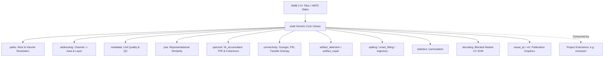

# 01. Architecture & Design Philosophy

`jnwb` is a dataset-agnostic, object-oriented, high-performance Python library designed for large-scale electrophysiology and Neurodata Without Borders (NWB 2.0+) analysis.

This document outlines the core architecture, scientific invariants, epistemic standards, and repository boundaries governing `jnwb`.

---

## 1. Core Philosophy: Generic Library Core vs. Domain Extensions

A fundamental architectural principle of `jnwb` is the strict separation between:
1. **Generic Electrophysiology Primitives (`jnwb/`)**: General mathematical operations, signal processing, time-frequency representations, representational similarity analysis (JRSA), artifact detection/repair, spike extraction, onset latency modeling, directed connectivity, decoding, and statistical null hypothesis testing.
2. **Project-Specific Domain Extensions**: Task structures, custom condition codes, sequence slot timings, and project-specific unit classification taxonomies.

### The `jnwb/` Boundary Invariant
`jnwb` makes **zero assumptions** about experimental conditions or task sequence rules.
- `jnwb` never imports from downstream project directories.
- This invariant is mechanically enforced by automated regression gates (`tests/test_jnwb_frozen_boundary.py`).
- Downstream projects consume `jnwb` as an imported library dependency.

---

## 2. Scientific & Epistemic Invariants

`jnwb` is built around rigorous physical and statistical invariants:

### A. Signal Class Independence
* **Physical Classes**: Spikes (SUA/MUA), Multi-unit activity envelopes (MUAe), Local Field Potentials (LFP), and behavioral covariates (pupil dilation, eye gaze, lick traces) represent distinct physical observables.
* **No Modality Pooling**: Analyses never aggregate or pool signals across distinct modalities without explicit, intermediate transformation and declared units.

### B. Estimand Disambiguation
Every analytical estimator computes a specific estimand:
$$\text{Prevalence} \neq \text{Magnitude} \neq \text{Information} \neq \text{Mechanism}$$
* **Prevalence**: Fraction of responsive or selective units/channels in a population.
* **Magnitude**: Absolute or normalized effect size (e.g., $\Delta\text{Hz}$, $\Delta\text{dB}$, SNR).
* **Information**: Decodability or mutual information in state space.
* **Mechanism**: Circuit-level causal drivers.

### C. Causal & Directional Verbs
$$\text{Association} \neq \text{Directionality} \neq \text{Causality}$$
* Linear correlation and mutual information establish non-directional association.
* Granger causality, phase slope index, and transfer entropy establish statistical temporal predictability.
* Perturbational manipulations (optogenetics, pharmacology, lesions) establish physical causality. We never use stronger causal verbs to describe weaker statistical associations.

### D. Mathematical vs. Analysis-Specific Conventions
* `jnwb` provides generic mathematical transforms (e.g. `to_db(ratio) = 10 * log10(ratio)`, `compute_psd`, `band_power`).
* Specific aggregation sequences (such as averaging raw power across trials before baseline ratio calculation, termed "Logarithm Last") are estimand-specific choices for particular relative power estimators; `jnwb` exposes the underlying primitives without hardcoding a specific project's aggregation pipeline.

### E. Unit of Inference & Hierarchical Structure
* Statistical tests and degrees of freedom must declare their exact inferential unit: unit, channel, trial, or session/subject.
* Clustering across sessions or subjects must use hierarchical models (GLMM) or session-cluster bootstrap resampling.

### F. Valid Nulls & No Synthetic Science
* A null finding ($p \ge \alpha$) is an empirical scientific observation, not an error. Analysis parameters, frequency bands, or temporal windows are never retrofitted to achieve significance.
* Outputs must never contain synthetic or placeholder values unless clearly marked with an explicit `PLACEHOLDER-DUMMY` warning during scaffolding.

---

## 3. Epistemic Claim Discipline

Every assertion in `jnwb` documentation, metadata, and test reports follows strict epistemic categorization:
$$\text{claim} \in \{\text{observed}, \text{derived}, \text{inferred}, \text{assumed}, \text{unknown}\}$$

1. **Observed**: Directly read from physical instrumentation or verified raw data files on disk.
2. **Derived**: Computed via deterministic mathematical operations from observed data without parameter fitting.
3. **Inferred**: Statistical estimates resulting from model fits, optimization, or hypothesis tests with specified assumptions and confidence bounds.
4. **Assumed**: Axiomatic priors, boundary constraints, or sampling window conventions.
5. **Unknown**: Quantities not empirically verified or where conflicting evidence remains unresolved.

---

## 4. Module Map & Architecture Summary

| Module | Core Responsibility | Primary Public Symbols in `jnwb.__all__` |
|--------|---------------------|------------------------------------------|
| `paths` | Data root discovery & volume remap management | `paths` |
| `addressing` | Spatial channel-to-area and depth-to-layer addressing | `map_peak_channel_to_area`, `classify_layer_from_depth`, `enrich_units_dataframe` |
| `metadata` | Unit quality classification, census, & SNR auditing | `get_all_units_metadata`, `classify_unit_quality`, `unit_census_report`, `get_snr_analysis`, `filter_by_criteria`, `audit_units`, `audit_electrodes`, `assign_quality_tier`, `compare_old_new_criteria`, `old_new_summary_table`, `electrode_inventory` |
| `ontology` | Structured query objects and event referencing | `Query`, `Dataset`, `AlignedDataset`, `Alignment`, `EpochCollection`, `Question`, `Result`, `Interpretation`, `Figure`, `Provenance`, `Lineage` |
| `jrsa` | Representational Similarity Analysis (RDMs, metrics) | `jrsa`, `JRSAResult` |
| `spectral` | Multi-taper spectral analysis, coherence, and PLV | `compute_psd`, `band_power`, `spectral_tilt`, `harmonic_analysis`, `imaginary_coherency`, `cross_area_coherence`, `bipolar_reference`, `laplacian_reference`, `to_db`, `CANONICAL_BANDS` |
| `tfr_accumulator` | Streaming trial-wise TFR accumulation | `TFRAccumulator`, `assert_mergeable` |
| `compression` | TFR sparse quantization and storage compression | `compress_fp32` |
| `analyzers` | High-level session analyzers | `TFRAnalyzer`, `UnitAnalyzer`, `PopulationAnalyzer` |
| `connectivity` | Directed connectivity, Granger, PSI, Transfer Entropy, MI | `granger`, `granger_spectral`, `granger_causality`, `phase_slope_index`, `transfer_entropy`, `directed_connectivity`, `directed_network`, `network_topology`, `spike_mutual_information`, `spike_count_mutual_information`, `binary_occupancy_mutual_information`, `bin_spikes`, `as_trials`, `DirectedResult` |
| `artifact_detection` | Channel and trial correlation matrix artifact detection | `channel_correlation_matrix`, `bad_channels_from_correlation`, `trial_correlation_matrix`, `bad_trials_single_channel`, `consensus_bad_trials` |
| `artifact_repair` | Cross-channel synchrony & cross-trial median repair | `repair_lfp_trials`, `repair_band_artifacts` |
| `spiking` | Spike metrics, significance testing, phase locking | `compute_response_metrics`, `classify_response_significance`, `phase_locking_index` |
| `onset_fitting` | Causal exponential smoothing & bounded onset latency fitting | `causal_exp_smooth`, `fit_exponential_onset`, `onset_model` |
| `trajectory` | State-space neural population trajectories | `build_time_resolved_matrix`, `compute_population_trajectory` |
| `statistics` | Bootstrap CIs, permutation nulls, paired fire tests, FDR | `StatisticalAnalysis`, `rate_in_window`, `fires_in_window`, `fire_indicator`, `paired_fire_prob_test`, `shuffle_pvalue_paired`, `shuffle_pvalue_unpaired`, `detect_trial_cycles`, `assign_subblock_quartiles`, `shuffle_r2_ci`, `cross_modal_comparison` |
| `permutation` | Grouped (`within_group`) and global label permutation | `permute_labels`, `build_permutation_plan` |
| `decoding` | Nested cross-validated linear SVM population decoding | `nested_cv_linear_svm`, `majority_baseline`, `fold_majority_baseline`, `assign_outer_folds`, `build_inner_validation_partitions`, `build_representation_ladder` |
| `visual_qc` | Multi-panel unit waveform and session QC figures | `visual_qc` |
| `viz` | Publication vector graphics standards & multi-panel saving | `setup_vector_graphics`, `apply_tight_auto_axis`, `save_figure_suite`, `resample_onsets`, `raster_psth` |
