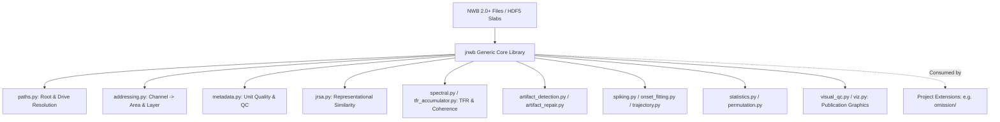

# 01. Architecture & Design Philosophy

`jnwb` is a dataset-agnostic, object-oriented, high-performance Python library designed for large-scale electrophysiology and Neurodata Without Borders (NWB 2.0+) analysis.

This document outlines the core architecture, scientific invariants, epistemic standards, and repository boundaries governing `jnwb`.

---

## 1. Core Philosophy: Dataset-Agnostic Generic Core vs. Domain Extensions

A fundamental architectural principle of `jnwb` is the strict separation between:
1. **Generic Electrophysiology Primitives (`jnwb/`)**: General mathematical operations, signal processing, time-frequency representations, representational similarity analysis (JRSA), artifact detection/repair, spike extraction, onset latency modeling, and statistical null hypothesis testing.
2. **Project-Specific Domain Extensions (`omission/`, etc.)**: Task structures, condition codes (e.g., `AXAB`, `BXBA`), sequence slot timings, and project-specific unit classification taxonomies.

### The `jnwb/` Boundary Invariant
`jnwb` makes **zero assumptions** about experimental conditions or task sequence rules.
- `jnwb` never imports from downstream project directories.
- This invariant is mechanically enforced by automated regression gates (`tests/test_jnwb_frozen_boundary.py`).
- Downstream projects consume `jnwb` as an imported library dependency.

---

## 2. Scientific & Epistemic Invariants

`jnwb` is built around rigorous physical and statistical invariants:

### A. Signal Class Independence
* **Physical Classes**: Spikes (SUA/MUA), Multi-unit activity envelopes (MUAe), Local Field Potentials (LFP), and behavioral covariates (pupil dilation, eye gaze, lick traces) represent distinct physical observables.
* **No Modality Pooling**: Analyses never aggregate or pool signals across distinct modalities without explicit, intermediate transformation and declared units.

### B. Estimand Disambiguation
Every analytical estimator computes a specific estimand:
$$\text{Prevalence} \neq \text{Magnitude} \neq \text{Information} \neq \text{Mechanism}$$
* **Prevalence**: Fraction of responsive or selective units/channels in a population.
* **Magnitude**: Absolute or normalized effect size (e.g., $\Delta\text{Hz}$, $\Delta\text{dB}$, SNR).
* **Information**: Decodability or mutual information in state space.
* **Mechanism**: Circuit-level causal drivers.

### C. Causal & Directional Verbs
$$\text{Association} \neq \text{Directionality} \neq \text{Causality}$$
* Linear correlation and mutual information establish non-directional association.
* Granger causality, phase slope index, and transfer entropy establish statistical temporal predictability.
* Perturbational manipulations (optogenetics, pharmacology, lesions) establish physical causality. We never use stronger causal verbs to describe weaker statistical associations.

### D. The "Logarithm Last" Invariant
When computing spectral power or decibel ratios:
1. Average raw power or cross-spectral densities across trials first: $\bar{P}(f, t) = \frac{1}{N}\sum_{i=1}^N P_i(f, t)$.
2. Normalize by baseline raw power: $\text{RelPower}(f, t) = \bar{P}(f, t) / \bar{P}_{\text{base}}(f)$.
3. Compute the decibel transformation **once at the final step**: $10 \log_{10}(\text{RelPower})$.
* *Never average pre-computed decibels across sites, channels, or animals.*

### E. Unit of Inference & Hierarchical Structure
* Statistical tests and degrees of freedom must declare their exact inferential unit: unit, channel, trial, or session/subject.
* Clustering across sessions or subjects must use hierarchical models (GLMM) or session-cluster bootstrap resampling.

### F. Valid Nulls & No Synthetic Science
* A null finding ($p \ge \alpha$) is an empirical scientific observation, not an error. Analysis parameters, frequency bands, or temporal windows are never retrofitted to achieve significance.
* Outputs must never contain synthetic or placeholder values unless clearly marked with an explicit `PLACEHOLDER-DUMMY` warning during scaffolding.

---

## 3. Epistemic Claim Discipline

Every assertion in `jnwb` documentation, metadata, and test reports follows strict epistemic categorization:
$$\text{claim} \in \{\text{observed}, \text{derived}, \text{inferred}, \text{assumed}, \text{unknown}\}$$

1. **Observed**: Directly read from physical instrumentation or verified raw data files on disk.
2. **Derived**: Computed via deterministic mathematical operations from observed data without parameter fitting.
3. **Inferred**: Statistical estimates resulting from model fits, optimization, or hypothesis tests with specified assumptions and confidence bounds.
4. **Assumed**: Axiomatic priors, boundary constraints, or sampling window conventions.
5. **Unknown**: Quantities not empirically verified or where conflicting evidence remains unresolved.

---

## 4. Module Map & Architecture Summary

| Module | Core Responsibility | Primary Data Structures & Inputs |
|--------|---------------------|----------------------------------|
| `paths.py` | Data root discovery & volume remap management | File paths, environment variables |
| `addressing.py` | Spatial channel-to-area and depth-to-layer addressing | Probe maps, channel indices, coordinate tables |
| `metadata.py` | Unit quality classification, census, & SNR auditing | Unit tables, spike metadata, electrode tables |
| `ontology.py` | Structured query objects and event referencing | Session descriptors, condition queries |
| `jrsa.py` | Representational Similarity Analysis (Condition RDMs, linear models) | Population trial matrices $(N \times T \times P)$ |
| `spectral.py` | Multi-taper spectral analysis, coherence, and PLV | Continuous LFP segments $(N \times C \times T)$ |
| `tfr_accumulator.py` | Memory-efficient trial-wise TFR accumulation | Streaming TFR data chunks |
| `compression.py` | TFR sparse quantization and storage compression | Large TFR arrays |
| `analyzers.py` | High-level `TFRAnalyzer` and `UnitAnalyzer` interfaces | NWB sessions, binned PSTH arrays, TFR tensors |
| `artifact_detection.py` | Channel and trial correlation matrix artifact detection | Segmented LFP arrays $(C \times T)$, $(N \times T)$ |
| `artifact_repair.py` | Cross-channel synchrony & cross-trial median repair | Raw LFP tensors $(N \times C \times T)$, TFR tensors |
| `spiking.py` | Spike timestamp binning, PSTH generation, firing rates | Raw spike times, event onsets |
| `onset_fitting.py` | Causal exponential smoothing & bounded onset latency fitting | PSTH rate traces, time coordinate arrays |
| `trajectory.py` | State-space neural population trajectories | Multi-unit spike rate matrices $(U \times T)$ |
| `statistics.py` | Bootstrap CIs, permutation nulls, paired fire tests, FDR | 1D/2D empirical arrays, boolean indicator pairs |
| `permutation.py` | Grouped (`within_group`) and global label permutation | Label arrays, cycle/group indices |
| `decoding.py` | Cross-validated population decoding & multimodal fusion | Feature matrices $X$, target vectors $y$ |
| `bilinear.py` / `nam.py` | Bilinear interaction decomposition & neural additive models | Multidimensional neural features |
| `visual_qc.py` | Multi-panel unit waveform and session QC figures | Waveform arrays, quality metadata |
| `viz.py` | Publication vector graphics standards & multi-panel saving | Matplotlib figures, axes |

---

## 5. Next Steps & Guide Traversal
- To understand data addressing and metadata extraction, see [02. Paths, Addressing & Metadata](02_paths_addressing_metadata.md).
- For Representational Similarity Analysis, see [03. Representational Similarity Analysis (JRSA)](03_representational_similarity_jrsa.md).
