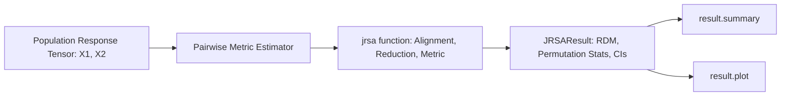

# 03. Representational Similarity Analysis (JRSA)

`jnwb.jrsa` runs representational similarity analysis (RSA) on neural time series: population firing rate tensors, multichannel LFP arrays, or any response tensor.

---

## 1. Overview & Core Architecture

RSA compares neural population geometry across experimental conditions without fitting a classifier.

The diagram below is the call order. Two response tensors enter, one `JRSAResult` leaves, and
`summary` and `plot` are read off that result rather than recomputed from the tensors.



### Key Capabilities
- **Metrics** (14):
  `"rsa"`, `"pearson"`, `"spearman"`, `"cosine"`, `"kendall"`, `"distance_correlation"`, `"mutual_information"`, `"transfer_entropy_histogram_nats"`, `"phase_slope"`, `"granger_ssr_ftest"`, `"hsic"`, `"cka"`, `"rv"`, `"procrustes"`.
  `"granger_ssr_ftest"` and `"transfer_entropy_histogram_nats"` are **not** the same estimands as connectivity ``granger`` or ``transfer_entropy`` — jRSA exposes the statsmodels SSR F-test and a plug-in histogram TE in nats on flattened arrays.
- **Tensor alignment**: 2D, 3D, and 4D tensors, with automatic trial/time alignment (`align="auto"`, `align_mode="fraction"`, `lag=0`).
- **Resampling**: permutation distributions (`permutations=1000`), bootstrap confidence intervals (`bootstrap=500`), and FDR correction (`correction="fdr_bh"`).
- **CPU arithmetic**: `jrsa` has no GPU path; every metric computes in NumPy on the CPU. Inputs may be NumPy arrays, `scipy.sparse` matrices (densified), JAX arrays, and torch tensors or CuPy arrays on any device (copied to the host); a masked array with a masked element raises. `backend` is recorded and moves no arithmetic, so `backend="cupy"` gives the same numbers on the CPU; `device="cuda"` warns and runs on the CPU, and `execution["device"]` records `cpu`. `n_jobs` parallelises over CPU workers, and `res.execution` records what ran.

---

## 2. Core API: `jnwb.jrsa`

### Basic Execution

```python
import numpy as np
import jnwb

# x1, x2: Population activity matrices (e.g. 12 conditions x 100 units x 50 timepoints)
result = jnwb.jrsa(
    x1,
    x2=None,            # If x2 is None, computes symmetric self-similarity
    metric="rsa",       # "rsa", "pearson", "cosine", "spearman", etc.
    stats=True,         # Enable permutation hypothesis testing
    permutations=1000,
    bootstrap=500,
    correction="fdr_bh",
    alpha=0.05
)

# Inspect statistical summary
result.summary()

# Render visualization
fig = result.plot()
```

### The `JRSAResult` Container Class

`jnwb.JRSAResult` encapsulates:
- `result.value`: Scalar or array of estimated similarities.
- `result.p`: Resampling p-value (when `stats=True`).
- `result.ci`: Bootstrap confidence intervals `(lower, upper)` when requested.
- `result.statistic`: Test statistic accompanying `p` when applicable.
- `result.null_distribution`: Array of surrogate permutation values when computed.

---

## 3. Sliding Windows and Lags

### Temporal Sliding Window Analysis

```python
# Compute sliding-window representational similarity across time
sliding_res = jnwb.jrsa(
    x1, x2,
    metric="pearson",
    window=(10, 30),
    sliding=True,
    lag=5
)
```

## 4. Missing Condition Handling & Preprocessing Invariants

- **Missing data (`nan_policy`)**: if conditions lack trials, `nan_policy="omit"` propagates `NaN` across the affected RDM pairs rather than fabricating zeros.
- **Preprocessing**: standardizing each condition's pattern before correlation-distance RSA changes nothing, because correlation centers and scales each pattern itself. Z-scoring each feature across conditions does change the RDM.

---

## 5. Standalone RDM Operations (`jnwb.rdm`, `jnwb.rdm_similarity`)

To build RDMs or compare precomputed dissimilarity matrices without running `jrsa`:

```python
# Compute pairwise distance matrix (N conditions x D features)
# Returns 1D condensed vector of length N*(N-1)//2 (default)
rdm_vec = jnwb.rdm(X, metric="correlation", condensed=True)

# Or full N x N symmetric square matrix with zero diagonal
rdm_sq = jnwb.rdm(X, metric="correlation", condensed=False)

# Compare two RDMs directly (Spearman, Pearson, Kendall, or Cosine)
rho, p_val = jnwb.rdm_similarity(rdm_vec1, rdm_vec2, metric="spearman")
```

## References

The methods on this page are cited in [References](references.md).
