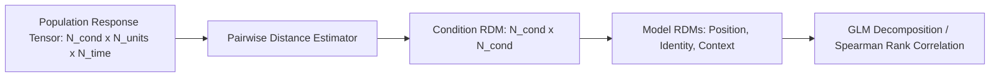

# 03. Representational Similarity Analysis (JRSA)

`jnwb.jrsa` provides a representational similarity analysis (RSA) engine tailored for high-dimensional neural time series, multi-channel LFP arrays, and population spike rate tensors.

---

## 1. Overview & Theoretical Foundation

Representational Similarity Analysis (RSA) compares neural population geometry across experimental conditions without fitting arbitrary classification hyperplanes or assuming linear separability.



### Key Estimands & Capabilities
1. **Condition RDMs**: Construct $C \times C$ dissimilarity matrices quantifying the distance between all pairs of condition response vectors.
2. **Multi-Lag Temporal Stacking**: Track representational geometry across time windows or sliding lags.
3. **Linear Model Decomposition**: Decompose neural geometry into theoretical predictors:
   $$\text{RDM}_{\text{neural}} = \beta_1 \text{RDM}_{\text{Position}} + \beta_2 \text{RDM}_{\text{Identity}} + \beta_3 \text{RDM}_{\text{Context}} + \epsilon$$
4. **GPU / CuPy Acceleration**: Transparent hardware acceleration for large-scale permutation tests and cross-validation folds.

---

## 2. Core API & Usage

### Basic RSA Pipeline

```python
import numpy as np
import jnwb

# X1, X2: Population activity matrices (Conditions x Features or Conditions x Time x Features)
result = jnwb.jrsa(X1, X2, metric="correlation", stats=True)

# Inspect statistical summary
result.summary()

# Render interactive or publication visualization
result.plot()
```

### Distance Metrics

`jnwb.jrsa` supports standard and cross-validated distance estimators:
- `"correlation"`: $1 - \rho(u, v)$ (scale-invariant Pearson dissimilarity).
- `"cosine"`: $1 - \frac{u \cdot v}{\|u\|_2 \|v\|_2}$ (angular distance).
- `"euclidean"`: Standard Euclidean distance $\|u - v\|_2$.
- `"mahalanobis"`: Variance-normalized distance accounting for noise covariance $\Sigma^{-1}$.

```python
# Compute Mahalanobis-weighted condition dissimilarity
res_mah = jnwb.jrsa(X1, X2, metric="mahalanobis", noise_cov=noise_covariance_matrix)
```

---

## 3. Condition Model Decomposition

Condition RDMs can be regressed against theoretical candidate models to determine what features drive neural population structure:

```python
from jnwb.jrsa import fit_rdm_model

# Neural RDM (C x C)
rdm_neural = result.rdm

# Dictionary of theoretical candidate RDMs (e.g. 12x12 sequence condition models)
model_rdms = {
    "position": rdm_pos,
    "stimulus_identity": rdm_stim,
    "context": rdm_context,
}

# Fit linear model decomposition: RDM_neural ~ sum(beta_k * RDM_k)
fit = fit_rdm_model(rdm_neural, model_rdms, method="nnls")  # Non-negative least squares
for model_name, beta in fit["betas"].items():
    print(f"Model {model_name}: beta = {beta:.4f}")
```

---

## 4. Multi-Lag Representation Stacking

For dynamically evolving neural state spaces, multi-lag stacking concatenates delayed activity vectors to preserve temporal trajectory information before computing dissimilarity:

```python
# Stack 3 time lags [-10ms, 0ms, +10ms]
stacked_X = jnwb.jrsa.multilag_stack(X, n_lags=3, lag_step_bins=2)
res_temporal = jnwb.jrsa(stacked_X, stacked_X, metric="correlation")
```

---

## 5. GPU Acceleration (`jnwb/gpu_pca.py`)

When analyzing massive condition-by-channel-by-time arrays or running large permutation distributions ($N_{\text{perm}} \ge 10{,}000$), `jnwb` transparently leverages CuPy/CUDA if available, falling back gracefully to vectorized NumPy/SciPy on CPU backends.

```python
# Set backend preference explicitly (or leave default 'auto')
res = jnwb.jrsa(X1, X2, backend="gpu")  # Uses CuPy on CUDA devices; falls back if unavailable
```

---

## 6. Mathematical Invariants & Precautions

1. **Pre-processing Invariance**: Z-scoring or standardizing features prior to correlation-distance RSA is mathematically redundant (correlation is intrinsically mean-centered and scale-invariant), but is mandatory for Euclidean distance.
2. **Missing Condition Handling**: If specific conditions lack trials in a session, `jnwb.jrsa` propagates `NaN` across affected RDM pairs rather than fabricating zeros or imputing artificial similarities.
