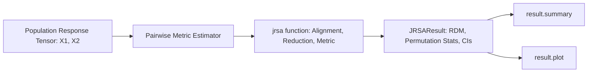

# 03. Representational Similarity Analysis (JRSA)

`jnwb.jrsa` provides a representational similarity analysis (RSA) engine tailored for high-dimensional neural time series, multi-channel LFP arrays, and population spike rate tensors.

---

## 1. Overview & Core Architecture

Representational Similarity Analysis (RSA) compares neural population geometry across experimental conditions without fitting arbitrary classification hyperplanes.



### Key Capabilities
1. **Multivariate Distance Metrics**: Supports 14 metrics spanning linear, rank, geometric, and information-theoretic geometry:
   `"rsa"`, `"pearson"`, `"spearman"`, `"cosine"`, `"kendall"`, `"distance_correlation"`, `"mutual_information"`, `"transfer_entropy"`, `"phase_slope"`, `"granger"`, `"hsic"`, `"cka"`, `"rv"`, `"procrustes"`.
2. **Flexible Tensor Alignments**: Handles 2D, 3D, and 4D tensors with automatic trial/time alignment (`align="auto"`, `align_mode="fraction"`, `lag=0`).
3. **Statistical Resampling**: Built-in permutation distributions (`permutations=1000`), bootstrap confidence intervals (`bootstrap=500`), and FDR correction (`correction="fdr_bh"`).
4. **GPU / CuPy Hardware Acceleration**: Automatic acceleration (`backend="auto"` or `backend="gpu"`) on CUDA-enabled environments with CPU fallback.

---

## 2. Core API: `jnwb.jrsa`

### Basic Execution

```python
import numpy as np
import jnwb

# x1, x2: Population activity matrices (e.g. 12 conditions x 100 units x 50 timepoints)
result = jnwb.jrsa(
    x1,
    x2=None,            # If x2 is None, computes symmetric self-similarity
    metric="rsa",       # "rsa", "pearson", "cosine", "spearman", etc.
    stats=True,         # Enable permutation hypothesis testing
    permutations=1000,
    bootstrap=500,
    correction="fdr_bh",
    alpha=0.05
)

# Inspect statistical summary
result.summary()

# Render visualization
fig = result.plot()
```

### The `JRSAResult` Container Class

`jnwb.JRSAResult` encapsulates:
- `result.similarity`: Scalar or array of estimated similarities.
- `result.pval`: Resampling p-value.
- `result.ci`: Bootstrap confidence intervals (lower, upper).
- `result.rdm`: Full condition dissimilarity matrix when applicable.
- `result.null_distribution`: Array of surrogate permutation values.

---

## 3. Sliding Windows, Lags & GPU Backends

### Temporal Sliding Window Analysis

```python
# Compute sliding-window representational similarity across time
sliding_res = jnwb.jrsa(
    x1, x2,
    metric="pearson",
    window=(10, 30),
    sliding=True,
    lag=5
)
```

### GPU Acceleration Backend

`jnwb.jrsa` interfaces with `jnwb.gpu_pca` and CuPy for massive tensor comparisons:

```python
# Explicitly request GPU backend
res_gpu = jnwb.jrsa(x1, x2, metric="rsa", backend="gpu")
```

---

## 4. Missing Condition Handling & Preprocessing Invariants

1. **Missing Data Policy (`nan_policy`)**: If specific conditions lack trials, `nan_policy="omit"` propagates `NaN` across affected RDM pairs rather than fabricating zeros.
2. **Preprocessing Invariants**: Z-scoring or standardizing features prior to correlation-distance RSA is mathematically redundant (correlation is intrinsically mean-centered and scale-invariant).
