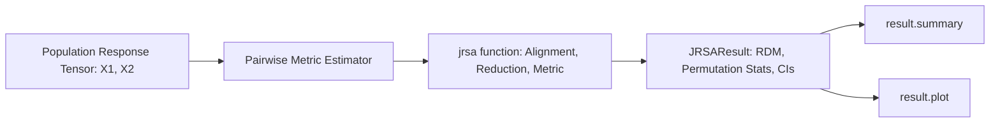

# 03. Representational Similarity Analysis (JRSA)

`jnwb.jrsa` runs representational similarity analysis (RSA) on any neural response tensor, such as population firing rates or multichannel LFP.

---

## 1. Overview & Core Architecture

RSA compares neural population geometry across experimental conditions without fitting a classifier.

The diagram is the call order: two tensors enter, one `JRSAResult` leaves, and `summary` and
`plot` read that result.



### Key Capabilities
- **Metrics** (14):
  `"rsa"`, `"pearson"`, `"spearman"`, `"cosine"`, `"kendall"`, `"distance_correlation"`, `"mutual_information"`, `"transfer_entropy_histogram_nats"`, `"phase_slope"`, `"granger_ssr_ftest"`, `"hsic"`, `"cka"`, `"rv"`, `"procrustes"`.
  `"granger_ssr_ftest"` and `"transfer_entropy_histogram_nats"` are **not** the same estimands as connectivity ``granger`` or ``transfer_entropy`` — jRSA exposes the statsmodels SSR F-test and a plug-in histogram TE in nats on flattened arrays.
- **Direction of the directed metrics**:

  | Metric | `jrsa(x1, x2, ...)` measures | Compare |
  |---|---|---|
  | `"granger_ssr_ftest"` | x2 → x1: how much x2's past predicts x1 | the reverse of `jnwb.granger(X, Y).x_to_y` |
  | `"transfer_entropy_histogram_nats"` | x2 → x1 | the reverse of `jnwb.transfer_entropy(X, Y).x_to_y` |
  | `"phase_slope"` | positive when x1 leads x2 | the same sign as `jnwb.phase_slope_index(X, Y).x_to_y` |
- **Tensor alignment**: 2D, 3D, and 4D tensors, with automatic trial/time alignment (`align="auto"`, `align_mode="fraction"`, `lag=0`).
- **Resampling**: permutation distributions (`permutations=1000`), bootstrap confidence intervals (`bootstrap=500`), and FDR correction (`correction="fdr_bh"`).
- **CPU arithmetic**: `jrsa` has no GPU path; every metric computes in NumPy on the CPU. Inputs may be NumPy arrays, `scipy.sparse` matrices (densified), JAX arrays, and torch tensors or CuPy arrays on any device (copied to the host); a masked array with a masked element raises. `backend` is recorded and moves no arithmetic, so `backend="cupy"` gives the same numbers on the CPU; `device="cuda"` warns and runs on the CPU, and `execution["device"]` records `cpu`. `n_jobs` parallelises over CPU workers, and `res.execution` records what ran.

---

## 2. Core API: `jnwb.jrsa`

### Basic Execution

```python
import numpy as np
import jnwb

# x1, x2: Population activity matrices (e.g. 12 conditions x 100 units x 50 timepoints)
result = jnwb.jrsa(
    x1,
    x2=None,            # If x2 is None, computes symmetric self-similarity
    metric="rsa",       # "rsa", "pearson", "cosine", "spearman", etc.
    stats=True,         # Enable permutation hypothesis testing
    permutations=1000,
    null="iid",         # conditions are exchangeable (see "The Permutation Null")
    bootstrap=500,
    correction="fdr_bh",
    alpha=0.05
)

# Inspect statistical summary
result.summary()

# Render visualization
fig = result.plot()
```

### The `JRSAResult` Container Class

`jnwb.JRSAResult` encapsulates:
- `result.value`: Scalar or array of estimated similarities.
- `result.p`: Permutation p-value when `stats=True` and `permutations > 0`; otherwise the metric's parametric p-value, or `None` for a metric without one. `alternative` sets its tail in both cases.
- `result.ci`: Bootstrap confidence intervals `(lower, upper)` when requested.
- `result.statistic`: Test statistic accompanying `p` when applicable.
- `result.null_distribution`: Array of surrogate permutation values when computed.

### The Permutation Null (`null=`)

Each permutation resamples x2 along one axis: the last axis for the paired metrics
(`"pearson"`, `"spearman"`, `"kendall"`, `"cosine"`, `"mutual_information"`,
`"granger_ssr_ftest"`, `"transfer_entropy_histogram_nats"`, `"phase_slope"`), and axis 0, the
conditions or observations, for `"rsa"`, `"cka"`, `"rv"`, `"hsic"`, `"distance_correlation"` and
`"procrustes"`. For the paired metrics the null and `lag` act on axis -1 whatever `adim` names,
so put time last; for the six axis-0 metrics both act on axis 0, the observations. A lag of l
pairs x1[t] with x2[t - l], dropping |l| samples; `execution['n_overlap']` records the count.

| `null=` | Resampling | Valid when |
|---|---|---|
| `None` (default) | `"circular_shift"` for the paired metrics, `"iid"` for the rest, with a warning | see those rows |
| `"circular_shift"` | rotate x2 by a random shift of 0 to n - 1 samples | each series is stationary; autocorrelation is kept. p cannot fall below about 1/n |
| `"block"` | permute consecutive blocks of `block_len` samples, which must be given | `block_len` spans several autocorrelation times. On independent AR(1) series with coefficient 0.9 (200 samples, 80 pairs), `block_len=20` rejected at p ≤ 0.05 for 0.30 of pairs with `"cka"` and 0.125 with `"pearson"`; `block_len=50` for 0.062 and 0.037 |
| `"iid"` | permute single samples | samples are independent. On two independent AR(1) series with coefficient 0.9 it rejects at p ≤ 0.05 about half the time |

`result.execution["null"]` records the scheme that ran and `result.execution["null_block_len"]`
the block length. Before 0.2.6.1 every metric used `"iid"`, so p-values of the paired metrics
on autocorrelated data have changed.

For the axis-0 metrics the default warns (`UserWarning`) whenever a null is formed. When axis 0
is time, the row permutation is invalid: `"cka"` and `"rv"` on independent AR(1) series rejected
every one of 40 pairs at p ≤ 0.05. Name `"circular_shift"` or `"block"` there, and `"iid"` when
the rows are exchangeable conditions; naming any scheme silences the warning. From 0.2.7 `null=`
must be named for these metrics.

`bootstrap > 0` with a paired metric raises unless `null="iid"` is named. The bootstrap resamples
single samples, which undercovers on autocorrelated data: on independent AR(1) pairs with
coefficient 0.9 the 95% interval of `"pearson"` covered 0 for 0.475 of pairs. A block bootstrap
is planned for 0.2.7. The axis-0 metrics' bootstrap is unchanged.

```python
# x1, x2: (12 conditions, 100 units, 50 timepoints); five blocks of 10 on the time axis
res = jnwb.jrsa(x1, x2, metric="pearson", null="block", block_len=10, rng=0)
res.execution["null"]   # "block"
```

---

## 3. Windows and Lags

### Sliding Windows

`jrsa` analyses one window per call; `sliding=True` raises `NotImplementedError`. `window` is a
`(start, stop)` pair of sample indices along the aligned axis, so a sliding-window analysis is a
loop over windows:

```python
# x1, x2: (12 conditions, 100 units, 50 timepoints); the aligned axis is time
width, step = 20, 5
n_times = x1.shape[-1]
starts = range(0, n_times - width + 1, step)
per_window = [
    jnwb.jrsa(x1, x2, metric="pearson", window=(s, s + width), lag=5, rng=0)
    for s in starts
]
values = np.array([float(r.value) for r in per_window])   # one value per window
```

The lag drops 5 of each window's 20 samples, so the circular-shift null runs on 15 and p
cannot fall below about 1/15, which is above 0.05.

Each call forms its own permutation null, so correct the per-window p-values together
(for example with `jnwb.StatisticalAnalysis.fdr_correct`) before reading any one of them.

## 4. Missing Condition Handling & Preprocessing Invariants

- **Missing data (`nan_policy`)**: `"omit"` drops every last-axis sample that is `NaN` anywhere in either input, so a condition with no trials leaves nothing: `"pearson"` and `"spearman"` raise `ValueError`; `"cka"` and `"rsa"` return `NaN`.
- **Preprocessing**: standardizing each condition's pattern before correlation-distance RSA changes nothing, because correlation centers and scales each pattern itself. Z-scoring each feature across conditions does change the RDM.

---

## 5. Standalone RDM Operations (`jnwb.rdm`, `jnwb.rdm_similarity`)

To build or compare RDMs without `jrsa`:

```python
# Compute pairwise distance matrix (N conditions x D features)
# Returns 1D condensed vector of length N*(N-1)//2 (default)
rdm_vec = jnwb.rdm(X, metric="correlation", condensed=True)

# Or full N x N symmetric square matrix with zero diagonal
rdm_sq = jnwb.rdm(X, metric="correlation", condensed=False)

# Compare two RDMs directly (Spearman, Pearson, Kendall, or Cosine)
rho, p_val = jnwb.rdm_similarity(rdm_vec1, rdm_vec2, metric="spearman")
```

## References

The methods on this page are cited in [References](references.md).
