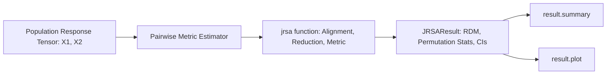

# 03. Representational Similarity Analysis (JRSA)

`jnwb.jrsa` provides a representational similarity analysis (RSA) engine tailored for high-dimensional neural time series, multi-channel LFP arrays, and population firing rate tensors.

---

## 1. Overview & Core Architecture

Representational Similarity Analysis (RSA) compares neural population geometry across experimental conditions without fitting arbitrary classification hyperplanes.

The diagram below is the call order. Two response tensors enter, one `JRSAResult` leaves, and
`summary` and `plot` are read off that result rather than recomputed from the tensors.



### Key Capabilities
1. **Multivariate Distance Metrics**: Supports 14 metrics spanning linear, rank, geometric, and information-theoretic geometry:
   `"rsa"`, `"pearson"`, `"spearman"`, `"cosine"`, `"kendall"`, `"distance_correlation"`, `"mutual_information"`, `"transfer_entropy_histogram_nats"`, `"phase_slope"`, `"granger_ssr_ftest"`, `"hsic"`, `"cka"`, `"rv"`, `"procrustes"`.
   These last two are **not** the same estimands as connectivity ``granger`` or ``transfer_entropy`` — jRSA exposes the statsmodels SSR F-test and a plug-in histogram TE in nats on flattened arrays.
2. **Flexible Tensor Alignments**: Handles 2D, 3D, and 4D tensors with automatic trial/time alignment (`align="auto"`, `align_mode="fraction"`, `lag=0`).
3. **Statistical Resampling**: Built-in permutation distributions (`permutations=1000`), bootstrap confidence intervals (`bootstrap=500`), and FDR correction (`correction="fdr_bh"`).
4. **CPU arithmetic**: every metric computes in NumPy on the CPU. `backend` accepts the input array types (`numpy`, `scipy`, `jax`, `torch`, `cupy`) and does not move the arithmetic; `device="cuda"` warns and runs on the CPU, and `execution["device"]` records `cpu`.

---

## 2. Core API: `jnwb.jrsa`

### Basic Execution

```python
import numpy as np
import jnwb

# x1, x2: Population activity matrices (e.g. 12 conditions x 100 units x 50 timepoints)
result = jnwb.jrsa(
    x1,
    x2=None,            # If x2 is None, computes symmetric self-similarity
    metric="rsa",       # "rsa", "pearson", "cosine", "spearman", etc.
    stats=True,         # Enable permutation hypothesis testing
    permutations=1000,
    bootstrap=500,
    correction="fdr_bh",
    alpha=0.05
)

# Inspect statistical summary
result.summary()

# Render visualization
fig = result.plot()
```

### The `JRSAResult` Container Class

`jnwb.JRSAResult` encapsulates:
- `result.value`: Scalar or array of estimated similarities.
- `result.p`: Resampling p-value (when `stats=True`).
- `result.ci`: Bootstrap confidence intervals `(lower, upper)` when requested.
- `result.statistic`: Test statistic accompanying `p` when applicable.
- `result.null_distribution`: Array of surrogate permutation values when computed.

---

## 3. Sliding Windows and Lags

### Temporal Sliding Window Analysis

```python
# Compute sliding-window representational similarity across time
sliding_res = jnwb.jrsa(
    x1, x2,
    metric="pearson",
    window=(10, 30),
    sliding=True,
    lag=5
)
```

### Execution

`jrsa` has no GPU path. `backend` names the input array library it accepts and every metric
converts to NumPy first, so `backend="cupy"` gives the same numbers on the CPU; `n_jobs`
parallelises over CPU workers. `res.execution` records what ran.

## 4. Missing Condition Handling & Preprocessing Invariants

1. **Missing Data Policy (`nan_policy`)**: If specific conditions lack trials, `nan_policy="omit"` propagates `NaN` across affected RDM pairs rather than fabricating zeros.
2. **Preprocessing Invariants**: Z-scoring or standardizing features prior to correlation-distance RSA is mathematically redundant (correlation is intrinsically mean-centered and scale-invariant).

---

## 5. Standalone RDM Operations (`jnwb.rdm`, `jnwb.rdm_similarity`)

For workflows that build custom RDMs or compare precomputed dissimilarity matrices
directly without running `jrsa`, `jnwb` exposes standalone operations:

```python
# Compute pairwise distance matrix (N conditions x D features)
# Returns 1D condensed vector of length N*(N-1)//2 (default)
rdm_vec = jnwb.rdm(X, metric="correlation", condensed=True)

# Or full N x N symmetric square matrix with zero diagonal
rdm_sq = jnwb.rdm(X, metric="correlation", condensed=False)

# Compare two RDMs directly (Spearman, Pearson, Kendall, or Cosine)
rho, p_val = jnwb.rdm_similarity(rdm_vec1, rdm_vec2, metric="spearman")
```

## References

The methods on this page are cited in [References](references.md).
