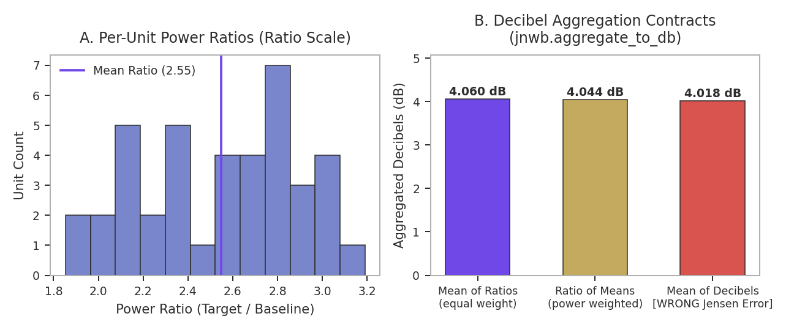
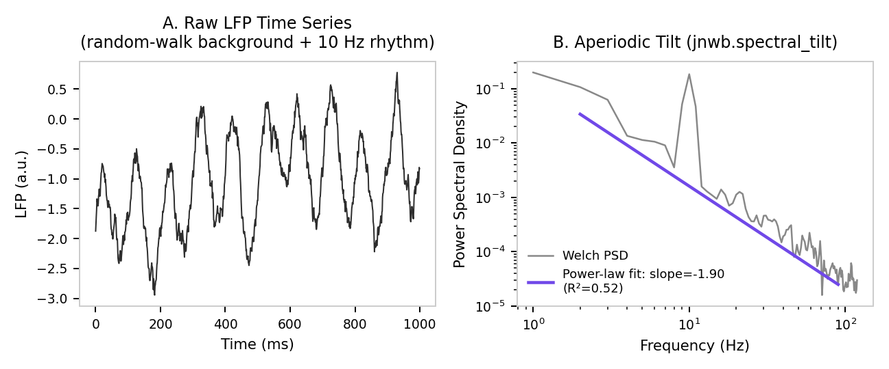
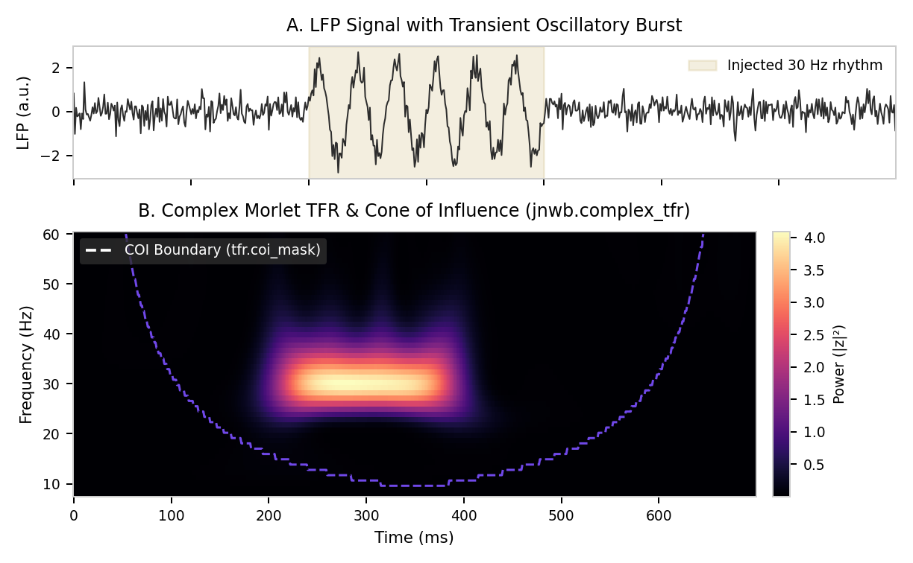

# 04. Spectral Analysis, Coherence & Time-Frequency Representations (TFR)

This document details spectral power estimation, time-frequency decomposition, cross-area coherence, memory-efficient accumulation, coordinate-explicit band extraction, and decibel transformations in `jnwb`.

---

## 1. Canonical Frequency Bands & Spectral Decomposition (`jnwb.spectral`)

`jnwb.spectral` provides standard tools for computing spectral power density, cross-spectral density, coherence, and referencing.

### Canonical Frequency Bands (`CANONICAL_BANDS`)

Unless customized by the user, `jnwb` standardizes frequency bands across modules:

```python
import jnwb

bands = jnwb.CANONICAL_BANDS
# Default:
# - theta: (4.0, 8.0) Hz
# - alpha: (8.0, 14.0) Hz
# - beta: (14.0, 30.0) Hz
# - low_gamma: (30.0, 50.0) Hz
# - high_gamma: (50.0, 80.0) Hz
```

### Power Spectral Density (`compute_psd`, `compute_multitaper_psd`) & Band Power (`band_power`)

```python
# Compute Welch PSD (returns frequencies and psd arrays)
freqs, psd = jnwb.compute_psd(lfp_trace, fs=1000.0)

# Compute DPSS multitaper PSD with explicit energy normalization
# nw: time-half-bandwidth product; k_tapers defaults to int(2*nw - 1)
freqs_mt, psd_mt = jnwb.compute_multitaper_psd(lfp_trace, fs=1000.0, nw=3.0, k_tapers=5)

# Extract scalar mean power in a specific frequency range (e.g. beta: 14-30 Hz)
beta_power_val = jnwb.band_power(lfp_trace, fs=1000.0, freq_range=(14.0, 30.0))
```

### Decibel Formation (`aggregate_to_db`, `to_db`, `DB_AGGREGATIONS`)

Take the logarithm **last**. Form the per-unit ratio `P / P0`, aggregate the *ratios*, and
convert once. Averaging decibels is a Jensen error -- `mean(log x) != log(mean x)` -- and it
biases every unit by its own noisiness, so a noisier channel is pulled toward a different
answer than a quiet one measuring the same effect.

`to_db(ratio)` is the bare conversion and cannot enforce anything: by the time a caller holds
decibels, the mistake is already available. `aggregate_to_db` is the enforcing form -- it owns
the whole ratio-aggregate-log sequence, so the correct order is the only order reachable
through it.

```python
# power, baseline: (n_units, n_trials), ratio-scale and non-negative
db = jnwb.aggregate_to_db(power, baseline, how="mean_of_ratios", aggregate_over=1)

# Element-wise conversion, no aggregation -- still logs exactly once
db_per_trial = jnwb.aggregate_to_db(power, baseline, how="mean_of_ratios")
```

**`how` has no default, on purpose.** The two members of `DB_AGGREGATIONS` are different
estimands, not implementation details:

| `how` | Estimand | Weighting |
|---|---|---|
| `"mean_of_ratios"` | mean of each unit's own ratio | every unit counts equally |
| `"ratio_of_means"` | summed power over summed baseline | each unit weighted by its baseline power |

They coincide only when the baseline is constant across the aggregated axis. In general
`sum_c P_c / sum_c P0_c = sum_c w_c (P_c / P0_c)` with `w_c = P0_c / sum_j P0_j`, so
`"ratio_of_means"` is a baseline-weighted version of the very same per-unit ratios. A silent
default would pick one of these for you.

**Geometric mean is deliberately rejected** rather than offered as a third option, because
`10*log10(geomean(r))` is *identically* `mean(10*log10(r))` -- it is mean-of-decibels wearing a
respectable name. Passing `how="geomean"` raises and says so.

**Negative input raises.** Ratio-scale power is non-negative by definition, whereas decibel
arrays routinely carry negative values, so handing decibels to this function usually fails
loudly instead of returning a plausible wrong number. Treat that as a guard, not a proof: an
all-positive decibel array is indistinguishable from power by inspection, so the contract still
stands -- pass power and baseline, never decibels.

`nan_policy="omit"` aggregates over non-NaN entries only. Artifact repair legitimately leaves
NaNs behind, so this is a real choice, but never a silent one.



### Spectral Tilt, Harmonic Analysis & Referencing

```python
# Estimate 1/f spectral tilt / exponent
tilt_res = jnwb.spectral_tilt(lfp_trace, fs=1000.0, freq_range=(1.0, 100.0))

# Harmonic distortion analysis
harmonics = jnwb.harmonic_analysis(lfp_trace, fs=1000.0, harmonic_orders=3)

# Spatial referencing schemes
bipolar_data = jnwb.bipolar_reference(lfp_multichannel)
laplacian_data = jnwb.laplacian_reference(lfp_multichannel)

# 1D Voltage Curvature (d2V/dz2 in V/m^2) and Current Source Density (CSD in A/m^3)
# lfp_probe: (n_channels, n_times) in Volts, ordered along probe depth
curv = jnwb.voltage_curvature_1d(lfp_probe, pitch_um=100.0, axis=0)
# CSD requires explicit extracellular conductivity (e.g. 0.3 S/m for cortex)
csd = jnwb.current_source_density_1d(lfp_probe, pitch_um=100.0, conductivity_s_per_m=0.3, axis=0)
```

### Digital Filtering (`bandpass_filter`, `notch_filter`)

Zero-phase (`zero_phase=True`, acausal forward-backward) and causal (`zero_phase=False`) filtering via Second-Order Sections (SOS):

```python
# Zero-phase Butterworth bandpass filter (14-30 Hz beta band)
beta_lfp = jnwb.bandpass_filter(lfp_trace, fs=1000.0, low_cut=14.0, high_cut=30.0, order=4, zero_phase=True)

# 60 Hz line-noise notch filter
clean_lfp = jnwb.notch_filter(lfp_trace, fs=1000.0, freq=60.0, q=30.0, zero_phase=True)
```



---

## 2. Cross-Area Coherence & Imaginary Coherency

### Cross-Area Coherence (`cross_area_coherence`)

Quantifies frequency-resolved phase synchronization between two LFP signals:

```python
coh_dict = jnwb.cross_area_coherence(
    lfp_area1,
    lfp_area2,
    fs=1000.0,
    freq_bands=jnwb.CANONICAL_BANDS
)
# Returns dict containing:
# - 'band_coherence': Dict[band_name -> float]
# - 'coherence_spectrum': np.ndarray (frequency-by-frequency coherence values)
# - 'frequencies': np.ndarray
```

### Imaginary Coherency (`imaginary_coherency`)

Computes imaginary coherency to eliminate volume conduction / zero-lag field spread artifacts:

```python
imag_coh = jnwb.imaginary_coherency(
    lfp_area1,
    lfp_area2,
    fs=1000.0,
    freq_range=(15.0, 30.0)
)
```

---

## 3. High-Level Analyzers (`jnwb.analyzers`)

`jnwb.analyzers` provides object-oriented interfaces for analyzing session data:

- `TFRAnalyzer`: Time-frequency analysis and coordinate-explicit band extraction.
- `UnitAnalyzer`: Single-unit spike train autocorrelation and quality metrics.
- `PopulationAnalyzer`: Multi-unit population PSTH and cross-condition comparisons.

### Coordinate-Explicit Band Extraction (`TFRAnalyzer.extract_band`)

Requires explicit physical frequency coordinates (`freqs`) and validates frequency axis alignment:

```python
from jnwb.analyzers import TFRAnalyzer

# tfr_data: (n_channels, n_freqs, n_times)
# freqs: (n_freqs,) exact physical frequency coordinates in Hz
beta_power = TFRAnalyzer.extract_band(
    tfr_data,
    band="beta",
    freqs=freqs,
    freq_axis=1
)
```

---

## 4. Decibel Transformation (`to_db`) & Estimand Considerations

`jnwb.to_db(ratio)` computes $10 \log_{10}(\text{ratio})$.

### Estimand Aggregation Notice
For baseline-normalized relative power estimands:
$$\text{RelPower}(f, t) = \frac{\bar{P}_{\text{response}}(f, t)}{\bar{P}_{\text{baseline}}(f)}$$
$$\text{Decibels}(f, t) = 10 \log_{10}\left(\text{RelPower}(f, t)\right) = \text{jnwb.to\_db}(\text{RelPower})$$

> **Design Note**: In relative power analyses, averaging raw power across trials before computing the ratio and applying `to_db` once at the end preserves the arithmetic mean of physical power. `jnwb` supplies the mathematical primitive `to_db` without enforcing a fixed aggregation pipeline on arbitrary workflows.

---

## 5. Complex Morlet Time-Frequency Representations & Accumulation

### Complex Morlet Transform Primitive (`complex_tfr`, `morlet_wavelet`)

`jnwb.complex_tfr` computes complex time-frequency coefficients via Morlet wavelets with discrete $L_1$ amplitude normalization:

```python
import jnwb
import numpy as np

# raw_lfp: (n_channels, n_times)
freqs = np.linspace(10.0, 60.0, 11)  # 10 to 60 Hz in 5 Hz steps

# Compute complex coefficients with Cone of Influence (COI) mask
tfr_res = jnwb.complex_tfr(
    data=raw_lfp,
    fs=1000.0,
    freqs=freqs,
    n_cycles=5.0,
    normalization="amplitude"  # unit cosine yields peak |z| = 1.0
)

# Returns ComplexTFR dataclass:
# - tfr_res.z: np.ndarray, complex (n_channels, n_freqs, n_times)
# - tfr_res.coi_mask: np.ndarray, bool (n_channels, n_freqs, n_times)
# - tfr_res.power: np.ndarray (|z|^2)
# - tfr_res.phase: np.ndarray (angle in radians)
# - tfr_res.amplitude: np.ndarray (|z|)
```



### Streaming TFR Accumulation (`TFRAccumulator`) & NWB fp32 Compression (`compress_fp32`)

- **`TFRAccumulator` & `assert_mergeable` (`jnwb.tfr_accumulator`)**: Accumulates running sums and sum-of-squares across streaming trials (`add_trial(tfr_res.z, valid=tfr_res.coi_mask)`) without storing complete trial tensors in RAM.
- **`compress_fp32` (`jnwb.compression`)**: On-disk NWB conversion — rewrites electrical-series datasets to `float32` inside an NWB file (path I/O, not in-memory array quantization):

```python
# src and dst are filesystem paths to .nwb files
report = jnwb.compress_fp32("raw_session.nwb", "compressed_session.nwb", verify=True)
assert report["verification"]["ok"] is True
```

## References

The methods on this page are cited in [References](references.md).
