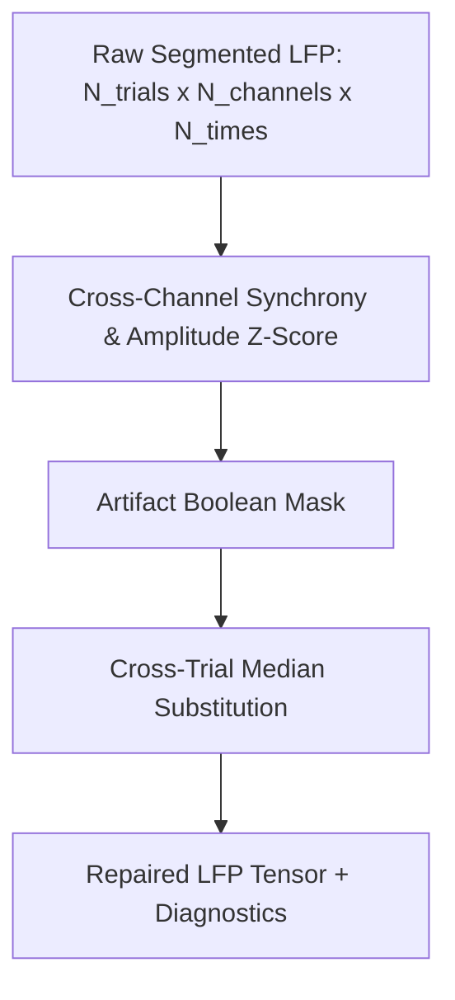

# 05. Artifact Detection & Signal Repair

This document details the public artifact detection and repair algorithms in `jnwb`, designed for high-density multi-channel electrophysiology and trial-segmented LFP/TFR data.

---

## 1. Overview & Repair Strategy

High-channel-count probes (e.g. Neuropixels, multi-shank arrays) suffer from distinct artifact modalities:
1. **Electrode Pop & Drift**: Single bad channels showing near-zero correlation or massive amplitude spikes.
2. **Chewing / Movement / Optical Transients**: Synchronous, high-amplitude excursions spanning many or all channels simultaneously on specific trials.

`jnwb` provides a two-stage strategy:
- **Detection (`jnwb.artifact_detection`)**: Statistical identification of bad channels and trials via cross-correlation and amplitude z-scores.
- **Repair (`jnwb.artifact_repair`)**: Substitution of artifact-corrupted samples with cross-trial medians to preserve array geometry without discarding entire trials.



---

## 2. Artifact Detection Primitives (`jnwb.artifact_detection`)

All 5 core artifact detection functions are exposed directly in the top-level `jnwb` namespace:

### Channel Correlation Matrix & Bad Channel Rejection
Computes the inter-channel correlation matrix and identifies disconnected or noisy electrodes via median correlation z-scores:

```python
import jnwb

# data: (n_channels, n_timepoints)
corr = jnwb.channel_correlation_matrix(data)

# Flag channels whose median correlation is z_thresh standard deviations below population mean
bad_chan_mask, mean_corrs, z_scores = jnwb.bad_channels_from_correlation(corr, z_thresh=2.5)
```

### Trial Correlation Matrix & Single-Channel Bad Trials
Identifies corrupted trials within an individual channel:

```python
# trials_data: (n_trials, n_timepoints)
trial_corr = jnwb.trial_correlation_matrix(trials_data)

bad_trials, corr_z, amp_z = jnwb.bad_trials_single_channel(
    trials_data,
    r_thresh=0.2,       # Minimum acceptable correlation with template
    amp_z_thresh=4.0    # Maximum acceptable peak-amplitude z-score
)
```

### Consensus Bad Trials Across Channels
Aggregates bad trial flags across multiple channels using a consensus voting threshold:

```python
# bad_flags: (n_channels, n_trials) boolean array
consensus_mask, bad_fractions = jnwb.consensus_bad_trials(
    bad_flags,
    min_frac_channels=0.5  # Flag trial if >50% of channels detected an artifact
)
```

---

## 3. High-Level Trial Repair Pipelines (`jnwb.artifact_repair`)

### `repair_lfp_trials`
Performs time-resolved cross-channel synchrony detection on trial-segmented LFP tensors, replacing flagged artifact intervals with the condition-matched cross-trial median:

```python
import jnwb

# segments: (n_trials, n_channels, n_times)
# times_ms: (n_times,) array of relative timestamps
repaired_lfp, frac_flagged, diagnostics = jnwb.repair_lfp_trials(
    segments,
    times_ms=times_ms,
    z_thresh=6.0,          # Threshold for cross-channel synchronous deviation
    window_ms=(-100, 500)   # Active evaluation interval
)

print(f"Total time-samples flagged and repaired: {frac_flagged * 100:.2f}%")
```

### `repair_band_artifacts`
Extends artifact repair into the time-frequency domain across canonical frequency bands:

```python
# power: (n_trials, n_channels, n_freqs, n_times)
# freqs: (n_freqs,) exact frequency coordinates
repaired_power, frac_by_band = jnwb.repair_band_artifacts(
    power,
    freqs=freqs,
    z_thresh=5.0
)
```

---

## 4. API Reference Summary

| Function | Primary Input | Returns | Purpose |
|----------|---------------|---------|---------|
| `channel_correlation_matrix` | $(C \times T)$ | $(C \times C)$ | Inter-electrode correlation |
| `bad_channels_from_correlation` | $(C \times C)$ | `(bad_mask, mean_corr, z_scores)` | Outlier channel detection |
| `trial_correlation_matrix` | $(N \times T)$ | $(N \times N)$ | Inter-trial waveform correlation |
| `bad_trials_single_channel` | $(N \times T)$ | `(bad_mask, corr_z, amp_z)` | Per-channel bad trial detection |
| `consensus_bad_trials` | $(C \times N)$ | `(consensus_mask, frac_channels)` | Multi-channel consensus voting |
| `repair_lfp_trials` | $(N \times C \times T)$ | `(repaired_lfp, frac_flagged, diag)` | Median substitution on raw LFP |
| `repair_band_artifacts` | $(N \times C \times F \times T)$ | `(repaired_power, frac_by_band)` | Median substitution on TFR |
