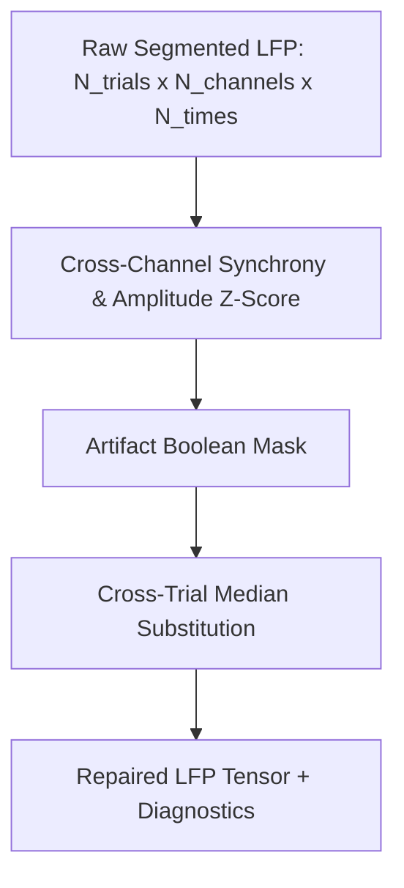

# 05. Artifact Detection & Signal Repair

This document details the public artifact detection and repair algorithms in `jnwb`, designed for high-density multi-channel electrophysiology and trial-segmented LFP/TFR data.

---

## 1. Overview & Repair Strategy

High-channel-count probes (e.g. Neuropixels, multi-shank arrays) suffer from distinct artifact modalities:
1. **Electrode Pop & Drift**: Single bad channels showing near-zero correlation or massive amplitude spikes.
2. **Chewing / Movement / Optical Transients**: Synchronous, high-amplitude excursions spanning many or all channels simultaneously on specific trials.

`jnwb` provides a two-stage strategy:
- **Detection (`jnwb.artifact_detection`)**: Statistical identification of bad channels and trials via cross-correlation and amplitude z-scores.
- **Repair (`jnwb.artifact_repair`)**: Substitution of artifact-corrupted samples with cross-trial medians to preserve array geometry without discarding entire trials.

The diagram below is where the geometry is preserved: a mask enters the repair step and a tensor
of the same shape leaves it.




Panel A of that figure is one synthetic trial carrying an injected synchronous excursion, with the peak
synchrony z-score the detector reports; panel B overlays `jnwb.repair_lfp_trials` on the same
trial, so what the substitution changed and what it left alone are read off one pair of traces.

---

## 2. Artifact Detection (`jnwb.artifact_detection`)

All 5 core artifact detection functions are exposed directly in the top-level `jnwb` namespace:

### Channel Correlation Matrix & Bad Channel Rejection
Computes the inter-channel correlation matrix and identifies disconnected or noisy electrodes via median correlation z-scores:

```python
import jnwb

# data: (n_channels, n_timepoints)
corr = jnwb.channel_correlation_matrix(data)

# Flag channels whose median correlation is z_thresh standard deviations below population mean
bad_chan_mask, mean_corrs, z_scores = jnwb.bad_channels_from_correlation(corr, z_thresh=2.5)
```

### Trial Correlation Matrix & Single-Channel Bad Trials
Identifies corrupted trials within an individual channel:

```python
# trials_data: (n_trials, n_timepoints)
trial_corr = jnwb.trial_correlation_matrix(trials_data)

bad_trials, corr_z, amp_z = jnwb.bad_trials_single_channel(
    trials_data,
    corr_z_thresh=5.0,  # Flag a trial whose median correlation to the OTHER trials
                        # is this many robust-z below theirs. It is a z-score, not a
                        # correlation, and there is no template: the comparison is
                        # against the rest of the trials on this channel.
    amp_z_thresh=5.0    # Maximum acceptable peak-amplitude robust-z
)
```

Either condition alone flags a trial. On a single channel that is deliberately
permissive; cross-channel consensus below is what decides exclusion.

### Consensus Bad Trials Across Channels
Aggregates bad trial flags across multiple channels using a consensus voting threshold:

```python
# bad_flags: (n_channels, n_trials) boolean array
consensus_mask, bad_fractions = jnwb.consensus_bad_trials(
    bad_flags,
    min_frac_channels=0.5  # Flag trial if >50% of channels detected an artifact
)
```

---

## 3. Trial Repair (`jnwb.artifact_repair`)

### `repair_lfp_trials`
Performs time-resolved cross-channel synchrony detection on trial-segmented LFP tensors, replacing flagged artifact intervals with the condition-matched cross-trial median:

```python
import jnwb

# segments: (n_trials, n_channels, n_times)
# times_ms: (n_times,) array of relative timestamps
repaired_lfp, frac_flagged, diagnostics = jnwb.repair_lfp_trials(
    segments,
    times_ms=times_ms,
    z_thresh=6.0,                    # Cross-channel synchronous-deviation threshold
    exclude_window_ms=(400.0, 600.0)  # PROTECTED, not analyzed: samples inside this
                                      # window are never flagged for repair. Use it
                                      # for an interval whose large deflection is
                                      # signal -- a reward artifact, say -- that the
                                      # synchrony detector would otherwise substitute
                                      # away. Omit it to evaluate the whole epoch.
)

print(f"Total time-samples flagged and repaired: {frac_flagged * 100:.2f}%")
```

### `detect_band_outliers` — the detection rule, on its own

`repair_band_artifacts` pairs a detector with a substitution. `detect_band_outliers` is that
detector alone, for callers who need the rule without the substitution:

```python
# band_trace: (n_trials, n_times), already reduced to one value per (trial, time)
flagged, scale = jnwb.detect_band_outliers(band_trace, z_thresh=6.0, sided="upper")
```

`trend` is the median over trials (the shared evoked shape), `resid = value - trend`, and
`scale` is `median(|resid|)` **pooled** over all `(trial, time)` — one global scale, not one per
time bin. A per-bin MAD is itself inflated during the evoked response, and would mask a real
outlier exactly where one matters most. A returned `scale` of `0.0` means the trend was matched
to round-off (relative to the data, so the rule does not depend on power units) and nothing was flagged.

!!! warning "`sided="both"` is not the conservative choice"
    The default `"upper"` flags power *increases* only. `"both"` also flags decreases — so when
    the response under study **is** a power decrease, a two-sided detector flags genuine
    decreases as artifacts and substitutes them away. The detector then eats the very effect it
    was meant to protect. Choose `"both"` only when artifacts in your data genuinely go in both
    directions.

    This is not hypothetical. A downstream reimplementation of this rule silently used a
    two-sided test while its own docstring claimed parity with the one-sided library version.
    The detector is exposed here precisely so the tail is an argument a caller states, rather
    than a detail buried in a copy that can drift.

`jnwb.DETECTION_TAILS` is the pair of accepted values, `("upper", "both")`, exported so a
caller can validate a configured tail before the call rather than after it:

```python
if tail not in jnwb.DETECTION_TAILS:
    raise ValueError(f"tail must be one of {list(jnwb.DETECTION_TAILS)}")
flagged, scale = jnwb.detect_band_outliers(band_trace, z_thresh=6.0, sided=tail)
```

`detect_band_outliers` raises `ValueError` naming the same list for anything else. There is
no `"lower"`: a detector that flags only power decreases has no artifact rationale, and
adding one would invite the mistake the warning above describes.

**Prefer calling over retyping.** A numerical rule that is easier to retype than to reuse will
be retyped, and the copy will diverge from its docstring without anyone noticing. That is why
`repair_band_artifacts` calls this function rather than restating it — the rule has exactly one
implementation — and why it accepts channel-averaged input (see below) rather than forcing a
fork on anyone whose array is shaped differently.

### `repair_band_artifacts`
Extends artifact repair into the time-frequency domain across canonical frequency bands:

```python
# power: (n_trials, n_channels, n_freqs, n_times)
# freqs: (n_freqs,) exact frequency coordinates
repaired_power, frac_by_band = jnwb.repair_band_artifacts(
    power,
    freqs=freqs,
    z_thresh=5.0
)
```

Channel-averaged power is accepted directly — pass `(n_trials, n_freqs, n_times)` and the same
reduced shape comes back:

```python
repaired_avg, frac_by_band = jnwb.repair_band_artifacts(power.mean(axis=1), freqs=freqs)
```

Both forms agree by construction: detection runs on the channel-averaged trace either way, so
the 3-D path is the 4-D path with a length-1 channel axis, not a second implementation. Pass
`sided="both"` only after reading the warning above.

---

## 4. API Reference Summary

| Function | Primary Input | Returns | Purpose |
|----------|---------------|---------|---------|
| `channel_correlation_matrix` | $(C \times T)$ | $(C \times C)$ | Inter-channel correlation |
| `bad_channels_from_correlation` | $(C \times C)$ | `(bad_mask, mean_corr, z_scores)` | Outlier channel detection |
| `trial_correlation_matrix` | $(N \times T)$ | $(N \times N)$ | Inter-trial waveform correlation |
| `bad_trials_single_channel` | $(N \times T)$ | `(bad_mask, corr_z, amp_z)` | Per-channel bad trial detection |
| `consensus_bad_trials` | $(C \times N)$ | `(consensus_mask, frac_channels)` | Multi-channel consensus voting |
| `repair_lfp_trials` | $(N \times C \times T)$ | `(repaired_lfp, frac_flagged, diag)` | Median substitution on raw LFP |
| `repair_band_artifacts` | $(N \times C \times F \times T)$ | `(repaired_power, frac_by_band)` | Median substitution on TFR |
