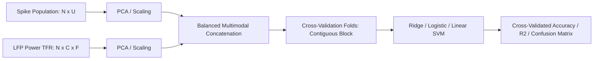

# 08. Population Decoding, Multimodal Fusion & Bilinear Models

This document details cross-validated population decoding, balanced multimodal feature fusion, bilinear interaction decomposition, and neural additive models in `jnwb`.

---

## 1. Cross-Validated Population Decoding (`jnwb/decoding.py`)

`jnwb.decoding` implements cross-validated decoders for classifying discrete stimulus conditions or regressing continuous behavioral variables from multi-channel spike and LFP populations.



### Basic Decoding Pipeline

```python
import jnwb.decoding as dec

# X: (n_trials, n_features) feature matrix
# y: (n_trials,) condition labels
# groups: (n_trials,) block/cycle grouping identifiers for fold isolation

decoder_res = dec.cross_validated_decode(
    X,
    y,
    groups=groups,
    classifier="linear_svm",
    n_splits=5,
    cv_scheme="blocked"   # Contiguous blocks prevent temporal autocorrelation leakage
)

print(f"Mean CV Accuracy: {decoder_res['mean_accuracy'] * 100:.2f}%")
print(f"Shuffle Null Baseline: {decoder_res['null_accuracy'] * 100:.2f}%")
print(f"Empirical p-value: {decoder_res['p_value']:.4f}")
```

---

## 2. Balanced Multimodal Latent Fusion

When combining modalities with vastly different dimensionalities and variances (e.g. 50 single units vs. 384 LFP channels $\times$ 40 frequency bins):
1. Compute independent dimensionality reduction on each modality: $Z_S = \text{PCA}(X_S)$, $Z_L = \text{PCA}(X_L)$.
2. Normalize variance per latent dimension.
3. Concatenate normalized representations: $Z_{\text{fusion}} = [Z_S, Z_L]$.

```python
# Balanced multimodal fusion pipeline
Z_fused = dec.balanced_multimodal_fusion(
    modality_arrays={"spikes": spike_matrix, "lfp": lfp_power_matrix},
    n_components_per_modality=10,
    normalize=True
)
```

---

## 3. Bilinear Models & Interaction Decomposition (`jnwb/bilinear.py`)

`jnwb.bilinear` models multiplicative interactions between two distinct neural populations or between neural state and behavioral context:

$$f(x, y) = x^T W y + b_1^T x + b_2^T y + c$$

```python
import jnwb.bilinear as bl

# Fit low-rank bilinear interaction between Area 1 (x) and Area 2 (y)
model = bl.LowRankBilinearRegressor(rank=3)
model.fit(X_area1, X_area2, target_y)

print("Explained Variance R2:", model.score(X_area1, X_area2, target_y))
```

---

## 4. Neural Additive Models (`jnwb/nam.py`)

`jnwb.nam` implements Neural Additive Models, allowing nonlinear feature modeling while preserving exact feature interpretability:

$$g(E[y]) = \beta_0 + \sum_{i=1}^M f_i(x_i)$$

Each feature function $f_i$ is parameterized as an independent neural sub-network, allowing visual inspection of how individual units or frequency components contribute to the prediction.
