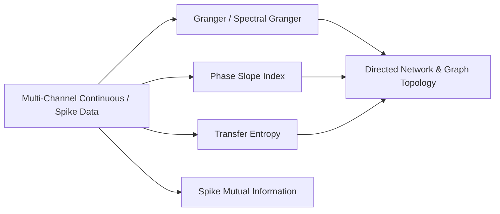

# 08. Directed Connectivity, Information Dynamics & Network Topology

## 1. Overview & Directed Invariants

`jnwb.connectivity` provides estimators for directed interaction between continuous time series (LFP, EEG) and point processes (spike trains): Granger and spectral Granger, Phase Slope Index (PSI), Transfer Entropy (TE), spike mutual information, and network topology.

The diagram below shows which estimators feed the network layer. Spike mutual information is the
one that does not: it is a pairwise quantity here and no edge carries it into the graph.



### Invariant: Statistical Predictability vs. Physical Causality
$$\text{Association} \neq \text{Directionality} \neq \text{Causality}$$
Granger causality, PSI, and TE establish statistical predictability / lag asymmetry in observed time series. `jnwb` distinguishes statistical directed metrics from perturbational physical causality.

---

## 2. Granger Causality & Spectral Granger (`granger`, `granger_spectral`)

> **Deprecation:** `granger_causality` (dict return type) is deprecated in 0.1.7. Use
> `jnwb.granger`, which returns `DirectedResult`.

Every directed estimator returns a `DirectedResult` with `x_to_y`, `y_to_x`, `net`, and optional `p_x_to_y` / `p_y_to_x` / `p_net` fields (not `statistic` / `pvalue`).

### Bivariate time-domain Granger

```python
import numpy as np
import jnwb

rng = np.random.default_rng(0)
X = rng.normal(size=500)
Y = np.zeros(500)
Y[1:] = 0.6 * X[:-1] + 0.2 * rng.normal(size=499)

result = jnwb.granger(
    X, Y,
    order="auto",
    max_lag=20,
    criterion="bic",
    n_surrogates=200,
    rng=0,
)
print(f"X -> Y: {result.x_to_y:.4f} (p={result.p_x_to_y:.4f})")
print(f"Y -> X: {result.y_to_x:.4f} (p={result.p_y_to_x:.4f})")
print(f"Net: {result.net:.4f}")
```

`order` is `"auto"` or a fixed integer >= 1. `granger`, `granger_spectral` and
`granger_causality` raise `ValueError` on `0`, a fraction or a bool rather than fitting a model
with no history, which would read as no coupling.

### Spectral Granger (`granger_spectral`)

Frequency-resolved Granger with optional band summaries in `per_band`:

```python
spectral_res = jnwb.granger_spectral(
    X, Y,
    fs=1000.0,
    bands=jnwb.CANONICAL_BANDS,
    n_freqs=256,
    n_surrogates=100,
    rng=0,
)
assert spectral_res.spectrum is not None
print("Beta-band summary:", spectral_res.per_band.get("beta"))
```

---

## 3. Phase Slope Index (`phase_slope_index`)

PSI estimates lag asymmetry from the slope of cross-spectral phase across frequency bins. Positive `net` (and `x_to_y` for PSI) indicates X leads Y under the PSI convention — observational directionality, not perturbational causality.

```python
psi_res = jnwb.phase_slope_index(
    X, Y,
    fs=1000.0,
    bands={"beta": (14.0, 30.0), "gamma": (30.0, 80.0)},
    jackknife=True,
    n_surrogates=200,
    rng=0,
)
print("PSI X -> Y:", psi_res.x_to_y)
print("Band summaries:", psi_res.per_band)
if psi_res.spectrum is not None:
    print("Freqs:", psi_res.spectrum["freqs"][:3], "...")
```


Panel A of that figure is `jnwb.granger` at order 15 on a synthetic pair with a known lead, and panel B is
`jnwb.phase_slope_index` on the same pair. Both name a direction in the statistics, and neither
names one in the tissue, which is the invariant stated above.

---

## 4. Transfer Entropy (`transfer_entropy`)

Information-theoretic directed coupling with explicit discretization strategy:

$$T_{X \to Y} = H(Y_t | Y_{t-1:t-k}) - H(Y_t | Y_{t-1:t-k}, X_{t-u:t-u-l+1})$$

`k` is the target history, `l` the source history and $u$ is `delay`, as in Schreiber (2000), eq. 4.

```python
te_res = jnwb.transfer_entropy(
    X, Y,
    k=1, l=1, delay=1,
    estimator="quantile",   # quantile | uniform | discrete
    bins=4,
    n_surrogates=200,
    rng=0,
)
print(f"TE X -> Y: {te_res.x_to_y:.4f} (p={te_res.p_x_to_y})")
print("units:", te_res.unit)   # bits
```

TE is reported in **bits** (the estimator uses $\log_2$), and the result carries
`unit='bits'` rather than leaving the base to be inferred. A TE of 0.05 bits is not
0.05 nats and not a percentage. The quantity is a reduction in uncertainty about $Y_t$
given $X$'s past: directed predictability, not a mechanism, and its magnitude depends on
the discretization (`estimator`, `bins`) as well as on the coupling.

`estimator="symbolic"` (ordinal patterns) raises `ValueError`. Its surrogate null is not
calibrated under zero-lag mixing: two noisy copies of one white source, with no directed
coupling, test significant in both directions. Use `"quantile"`.

---

## 5. Spike Mutual Information (`spike_mutual_information`, `spike_count_mutual_information`)

```python
spike_times1 = np.array([0.01, 0.05, 0.12, 0.2])
spike_times2 = np.array([0.02, 0.06, 0.15, 0.25])

# Binary occupancy MI (default) or spike-count MI via estimator=
mi_bin = jnwb.spike_mutual_information(
    spike_times1, spike_times2,
    time_window=(0.0, 0.5),
    bin_size_ms=10.0,
    estimator="binary_occupancy",
)

mi_count = jnwb.spike_count_mutual_information(
    spike_times1, spike_times2,
    time_window=(0.0, 0.5),
    bin_size_ms=10.0,
)
```

Both mutual informations are in **bits**, from the same $\log_2$ convention. MI is
symmetric, so neither value carries a direction however the arguments are ordered, and
both are bounded above by the entropy of the coarser variable: with 10 ms bins over a
0.5 s window, binary occupancy MI cannot exceed 1 bit per bin.

---

## 6. All-to-All Directed Networks & Graph Topology

### Pairwise and network-level coupling

`directed_connectivity` is **pairwise** (two signals). `directed_network` takes a mapping of channel labels to signals and returns matrices plus per-pair `DirectedResult` objects.

```python
signals = {"A": X, "B": Y, "C": rng.normal(size=500)}

pair = jnwb.directed_connectivity(X, Y, method="granger", order=2, n_surrogates=50, rng=0)

network = jnwb.directed_network(
    signals,
    method="granger",
    order=2,
    fdr=True,
    n_surrogates=50,
    rng=0,
)
print("Labels:", network["labels"])
print("Directed matrix shape:", network["matrix"].shape)   # M[i, j]: influence of i on j
```

### Graph topology metrics (`network_topology`)

```python
topo = jnwb.network_topology(network["matrix"], threshold=0.0)
print("In-degrees:", topo["in_degrees"])
print("Out-degrees:", topo["out_degrees"])
print("Density:", topo["density"])
```

## References

The methods on this page are cited in [References](references.md).
