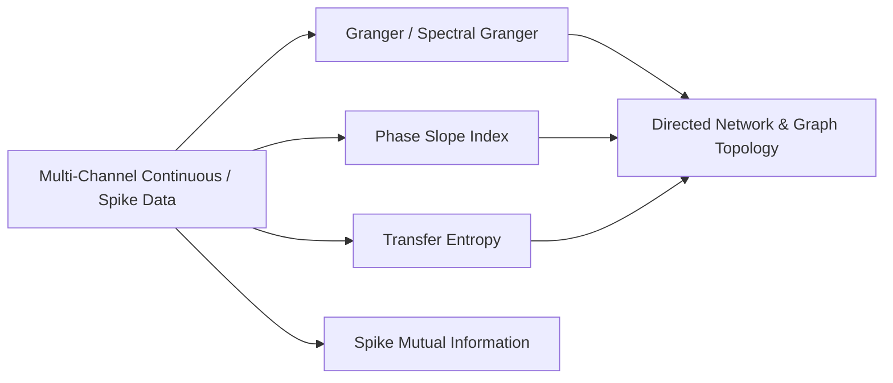
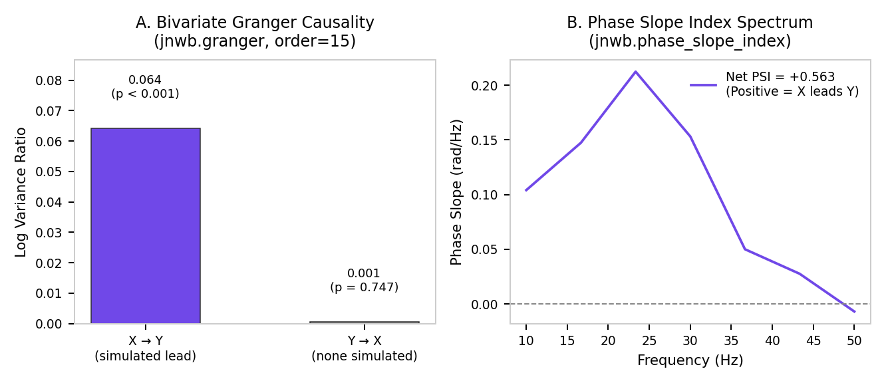

# 08. Directed Connectivity, Information Dynamics & Network Topology

This document details directed functional and effective connectivity, spectral Granger causality, Phase Slope Index (PSI), Transfer Entropy (TE), spike mutual information, and network graph topology in `jnwb`.

---

## 1. Overview & Directed Invariants

`jnwb.connectivity` provides estimators for directed interaction between continuous time series (LFP, EEG) and point processes (spike trains).



### Invariant: Statistical Predictability vs. Physical Causality
$$\text{Association} \neq \text{Directionality} \neq \text{Causality}$$
Granger causality, Phase Slope Index, and Transfer Entropy establish statistical predictability / lag asymmetry in observed time series. `jnwb` distinguishes statistical directed metrics from perturbational physical causality.

---

## 2. Granger Causality & Spectral Granger (`granger`, `granger_spectral`, `granger_causality`)

Every directed estimator returns a `DirectedResult` with `x_to_y`, `y_to_x`, `net`, and optional `p_x_to_y` / `p_y_to_x` / `p_net` fields (not `statistic` / `pvalue`).

### Bivariate time-domain Granger

```python
import numpy as np
import jnwb

rng = np.random.default_rng(0)
X = rng.normal(size=500)
Y = np.zeros(500)
Y[1:] = 0.6 * X[:-1] + 0.2 * rng.normal(size=499)

result = jnwb.granger(
    X, Y,
    order="auto",
    max_lag=20,
    criterion="bic",
    n_surrogates=200,
    seed=0,
)
print(f"X -> Y: {result.x_to_y:.4f} (p={result.p_x_to_y:.4f})")
print(f"Y -> X: {result.y_to_x:.4f} (p={result.p_y_to_x:.4f})")
print(f"Net: {result.net:.4f}")
```

### Spectral Granger (`granger_spectral`)

Frequency-resolved Granger with optional band summaries in `per_band`:

```python
spectral_res = jnwb.granger_spectral(
    X, Y,
    fs=1000.0,
    bands=jnwb.CANONICAL_BANDS,
    n_freqs=256,
    n_surrogates=100,
    seed=0,
)
assert spectral_res.spectrum is not None
print("Beta-band summary:", spectral_res.per_band.get("beta"))
```

---

## 3. Phase Slope Index (`phase_slope_index`)

PSI estimates lag asymmetry from the slope of cross-spectral phase across frequency bins. Positive `net` (and `x_to_y` for PSI) indicates X leads Y under the PSI convention — observational directionality, not perturbational causality.

```python
psi_res = jnwb.phase_slope_index(
    X, Y,
    fs=1000.0,
    bands={"beta": (14.0, 30.0), "gamma": (30.0, 80.0)},
    jackknife=True,
    n_surrogates=200,
    seed=0,
)
print("PSI X -> Y:", psi_res.x_to_y)
print("Band summaries:", psi_res.per_band)
if psi_res.spectrum is not None:
    print("Freqs:", psi_res.spectrum["freqs"][:3], "...")
```



---

## 4. Transfer Entropy (`transfer_entropy`)

Information-theoretic directed coupling with explicit discretization strategy:

$$T_{X \to Y} = H(Y_t | Y_{t-1:t-l}) - H(Y_t | Y_{t-1:t-l}, X_{t-u:t-u-k})$$

```python
te_res = jnwb.transfer_entropy(
    X, Y,
    k=1, l=1, delay=1,
    estimator="quantile",   # quantile | uniform | discrete | symbolic
    bins=4,
    n_surrogates=200,
    seed=0,
)
print(f"TE X -> Y: {te_res.x_to_y:.4f} (p={te_res.p_x_to_y})")
```

---

## 5. Spike Mutual Information (`spike_mutual_information`, `spike_count_mutual_information`)

```python
spike_times1 = np.array([0.01, 0.05, 0.12, 0.2])
spike_times2 = np.array([0.02, 0.06, 0.15, 0.25])

# Binary occupancy MI (default) or spike-count MI via estimator=
mi_bin = jnwb.spike_mutual_information(
    spike_times1, spike_times2,
    time_window=(0.0, 0.5),
    bin_size_ms=10.0,
    estimator="binary_occupancy",
)

mi_count = jnwb.spike_count_mutual_information(
    spike_times1, spike_times2,
    time_window=(0.0, 0.5),
    bin_size_ms=10.0,
)
```

---

## 6. All-to-All Directed Networks & Graph Topology

### Pairwise and network-level coupling

`directed_connectivity` is **pairwise** (two signals). `directed_network` takes a mapping of channel labels to signals and returns matrices plus per-pair `DirectedResult` objects.

```python
signals = {"A": X, "B": Y, "C": rng.normal(size=500)}

pair = jnwb.directed_connectivity(X, Y, method="granger", order=2, n_surrogates=50, seed=0)

network = jnwb.directed_network(
    signals,
    method="granger",
    order=2,
    fdr=True,
    n_surrogates=50,
    seed=0,
)
print("Labels:", network["labels"])
print("Net matrix shape:", network["matrix"].shape)
```

### Graph topology metrics (`network_topology`)

```python
topo = jnwb.network_topology(network["matrix"], threshold=0.0)
print("In-degrees:", topo["in_degrees"])
print("Out-degrees:", topo["out_degrees"])
print("Density:", topo["density"])
```

## References

The methods on this page are cited in [References](references.md).
