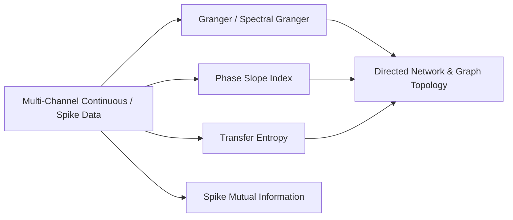

# 08. Directed Connectivity, Information Dynamics & Network Topology

This document details directed functional and effective connectivity, spectral Granger causality, Phase Slope Index (PSI), Transfer Entropy (TE), spike mutual information, and network graph topology in `jnwb`.

---

## 1. Overview & Directed Invariants

`jnwb.connectivity` provides estimators for directed interaction between continuous time series (LFP, EEG) and point processes (spike trains).



### Invariant: Statistical Predictability vs. Physical Causality
$$\text{Association} \neq \text{Directionality} \neq \text{Causality}$$
Granger causality, Phase Slope Index, and Transfer Entropy establish statistical predictability / lag asymmetry in observed time series. `jnwb` distinguishes statistical directed metrics from perturbational physical causality.

---

## 2. Granger Causality & Spectral Granger (`granger`, `granger_spectral`, `granger_causality`)

### Bivariate & Multivariate Time-Domain Granger

```python
import jnwb

# X, Y: continuous 1D or trial-segmented arrays
result = jnwb.granger(
    X, Y,
    order="auto",         # Order selection via AIC/BIC
    max_lag=20,
    criterion="bic",
    n_surrogates=200,     # Time-shift null distribution
    seed=0
)
# Returns a DirectedResult object
print(f"F-statistic: {result.statistic:.4f}, p-value: {result.pvalue:.4f}")
print(f"Net Directionality (X->Y vs Y->X): {result.net_direction}")
```

### Spectral Granger Causality (`granger_spectral`)

Decomposes Granger causality into specific frequency bands:

```python
spectral_res = jnwb.granger_spectral(
    X, Y,
    fs=1000.0,
    bands=jnwb.CANONICAL_BANDS,
    n_freqs=256,
    n_surrogates=100
)
# Returns frequency-resolved causality spectra and band summaries
```

---

## 3. Phase Slope Index (`phase_slope_index`)

The Phase Slope Index (PSI) estimates directed coupling from the slope of the cross-spectral phase over frequency bands, robust against instantaneous volume conduction:

$$\tilde{\Psi}_{xy} = \text{Im}\left(\sum_f S_{xy}^*(f) S_{xy}(f + \delta f)\right)$$

```python
psi_res = jnwb.phase_slope_index(
    X, Y,
    fs=1000.0,
    bands={"beta": (14.0, 30.0), "gamma": (30.0, 80.0)},
    jackknife=True,
    n_surrogates=200
)
print("PSI normalized value:", psi_res.statistic)
```

---

## 4. Transfer Entropy (`transfer_entropy`)

Non-parametric, model-free information-theoretic directed coupling measuring reduction in uncertainty of $Y$ given past values of $X$:

$$T_{X \to Y} = H(Y_t | Y_{t-1:t-l}) - H(Y_t | Y_{t-1:t-l}, X_{t-u:t-u-k})$$

```python
te_res = jnwb.transfer_entropy(
    X, Y,
    k=1, l=1, delay=1,
    estimator="quantile",   # "quantile", "symbolic", or "kraskov"
    bins=4,
    n_surrogates=200
)
```

---

## 5. Spike Mutual Information (`spike_mutual_information`, `spike_count_mutual_information`)

Estimates mutual information between spike trains:

```python
# Binary occupancy mutual information
mi_bin = jnwb.spike_mutual_information(
    spike_times1, spike_times2,
    time_window=(0.0, 1.0),
    bin_size_ms=10.0,
    estimator="binary_occupancy"
)

# Spike count mutual information
mi_count = jnwb.spike_count_mutual_information(
    spike_times1, spike_times2,
    time_window=(0.0, 1.0),
    bin_size_ms=10.0
)
```

---

## 6. All-to-All Directed Networks & Graph Topology

### Network Matrix Computation (`directed_connectivity`, `directed_network`)

```python
# Compute pairwise connectivity matrix across N channels
conn_matrix = jnwb.directed_connectivity(
    data_matrix,          # (n_channels, n_timepoints)
    method="granger",     # "granger", "psi", or "transfer_entropy"
    fs=1000.0
)

# Build graph representation with surrogate thresholding
network = jnwb.directed_network(conn_matrix, alpha=0.01)
```

### Graph Topology Metrics (`network_topology`)

Computes node degree, out-degree/in-degree ratios, clustering coefficients, and hub centrality:

```python
topo = jnwb.network_topology(adjacency_matrix=network.adjacency, threshold=0.3)
print("Node in-degrees:", topo["in_degree"])
print("Node out-degrees:", topo["out_degree"])
print("Network density:", topo["density"])
```
