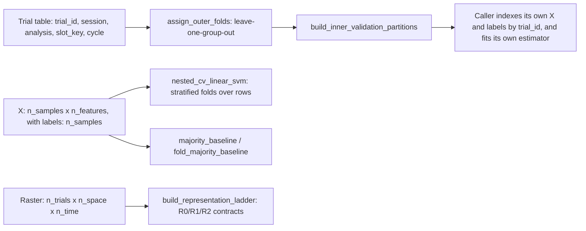

# 09. Population Decoding, Visual QC & Publication Graphics

## 1. Population Decoding & Nested Cross-Validation (`jnwb.decoding`)

`jnwb.decoding` provides a linear support vector machine (SVM) decoder with nested cross-validation, majority baselines, and separate fold-partitioning functions that hold out whole groups against temporal autocorrelation leakage.

The diagram below has three entry points and no edge between them, which is the separation this
page turns on: the partitioning chain on the trial table never reaches `nested_cv_linear_svm`.



### Nested CV Linear SVM Decoding (`nested_cv_linear_svm`)

```python
import jnwb

# X: (n_samples, n_features) feature matrix
# labels: (n_samples,) integer condition labels
decode_res = jnwb.nested_cv_linear_svm(X, labels, n_splits=5)

print("CV Accuracy:", decode_res["accuracy"])
print("Majority Baseline:", decode_res["majority_baseline_accuracy"])
print("F1 Score:", decode_res["f1"])
print("ROC-AUC:", decode_res["auc"])
```

**This call does not hold out groups.** `nested_cv_linear_svm(X, labels, n_splits, rng)`
takes no `groups` argument: its folds are drawn over rows. When rows are trials from the
same block, cycle or session, neighboring trials share slow drift and a fold boundary
inside a block leaks it, so the accuracy is above what the same decoder would reach on a
held-out block.

`assign_outer_folds` and `build_inner_validation_partitions` below compute the
group-held-out partitions, and **no jnwb call applies them.** The decoder declares no
parameter that takes a partition table, and it returns metrics rather than a fitted
estimator, so a caller cannot score a held-out group with it either. Applying them means
fitting your own estimator over the trial ids they list. Treat what this function returns
as a row-wise upper bound on the grouped number and report it as one, read against
`majority_baseline_accuracy`, which is returned for that purpose and is not 0.5 unless the
classes are balanced.


Panel A of that figure is the per-fold accuracy drawn against `majority_baseline_accuracy`,
which is the comparison the paragraph above asks for. Panel B is the out-of-fold AUC and F1 against chance. Both
are row-wise folds on synthetic data, so the number is the upper bound described above, not a
grouped result.

### Baselines & Fold Partitions

```python
# Unconditioned majority class baseline
base_acc = jnwb.majority_baseline(labels)

# Fold-aware majority baseline
fold_acc = jnwb.fold_majority_baseline(y_train, y_test)

# Assign outer folds by holding out whole groups. This takes a trial TABLE, not a
# label vector: `trials` needs trial_id, the analysis_cols that identify an
# independent stratum, and the group column that folds hold out whole. Folds are
# assigned separately within each stratum, and a stratum with fewer than two groups
# is marked "insufficient_groups" rather than given an invented split.
outer_folds = jnwb.assign_outer_folds(trials, group_col="cycle")

# Nested inner train/validation partitions, long format: one row per
# (stratum, outer_fold, inner_fold, trial_id), with `inner_role` one of
# "inner_train", "inner_validation", "insufficient_training_groups". The outer test
# group is never used in an inner partition.
inner_splits = jnwb.build_inner_validation_partitions(outer_folds)

# Applying them is the caller's job: select the trial ids for one inner fold, then index
# your own X and labels with them and fit your own estimator.
one_fold = inner_splits[(inner_splits["outer_fold"] == 0) & (inner_splits["inner_fold"] == 0)]
train_ids = one_fold.loc[one_fold["inner_role"] == "inner_train", "trial_id"].to_numpy()
val_ids = one_fold.loc[one_fold["inner_role"] == "inner_validation", "trial_id"].to_numpy()

# R0/R1/R2 representation contracts from a (n_trials, n_space, n_time) raster.
# This fits no model and takes no labels: it reports what each representation
# preserves. R0 collapses time, R1 vectorizes without discarding samples, R2 keeps
# the tensor and records the space-axis topology constraint. LFP requires
# spatial_axis_metadata; SPK units are unordered without a preregistered order.
ladder_res = jnwb.build_representation_ladder(raster, modality="SPK")
```

---

## 2. Automated Electrophysiology Visual QC (`jnwb.visual_qc`)

`jnwb.visual_qc` draws multi-panel figures for inspecting spike sorting, waveform stability, and noise distributions.

### Unit Waveform Pagination & Noise Diagnostics

All three take a units or comparison **DataFrame**, not raw signals, and none of them
groups for you.

```python
import jnwb

# Six panels: firing rate, SNR, waveform duration, quality, quality by area, stability.
# `session_ids` filters rows; there is no `group_by` parameter.
fig_dist = jnwb.visual_qc.plot_unit_quality_distribution(units_df, session_ids=[1, 2])

# 2x2 noise vs. signal diagnostic panel, from the same units table --
# not from LFP segments or spike trains.
fig_noise = jnwb.visual_qc.plot_noise_vs_signal(units_df)

# Multi-session QC comparison bars. Takes the DataFrame that
# diagnostics.compare_sessions() returns, not a list of per-session results.
fig_comp = jnwb.visual_qc.compare_session_quality(sessions_comparison_df)
```

---

## 3. Publication Vector Graphics Standards (`jnwb.viz`)

### The Editable Vector Text Standard (`setup_vector_graphics`)

Standard matplotlib exports frequently convert text into non-editable paths. `jnwb.setup_vector_graphics` configures matplotlib rcParams for full text editability in Adobe Illustrator and Inkscape:

```python
import jnwb

# Call once at the start of a script or notebook
jnwb.setup_vector_graphics()
# Sets exactly three rcParams:
# - svg.fonttype    = 'none'  (preserves text as true SVG text elements)
# - font.sans-serif = ['Arial', 'Helvetica', 'DejaVu Sans']
# - font.family     = 'sans-serif'
```

**SVG only.** It does not touch `pdf.fonttype` or `ps.fonttype`, so PDF and EPS exports
still embed text as Type-3 paths. Set those yourself when the target is PDF:

```python
import matplotlib.pyplot as plt

plt.rcParams["pdf.fonttype"] = 42
plt.rcParams["ps.fonttype"] = 42
```

### Tight Auto-Axis Bounding (`apply_tight_auto_axis`)

Pins the x-axis to `x_span` and fits the y-axis to the plotted lines with a margin. The y lower
limit is floored at 0, so negative values are drawn outside the axes; do not use it on signed
data such as z-scores or LFP.

```python
import matplotlib.pyplot as plt

fig, ax = plt.subplots()
ax.plot([0, 1, 2], [10, 20, 15])

# x-axis pinned to (0, 2); y-axis fitted to the line with a 10% margin
jnwb.apply_tight_auto_axis(ax, x_span=(0, 2), y_margin=0.10)
```

### Multi-Format Figure Suite Saving (`save_figure_suite`)

Saves each figure in each requested format (SVG for layout, PDF for vector review, PNG for slide presentations), one file per figure and format, at `dpi` (default 300) for the raster formats:

```python
jnwb.save_figure_suite(
    figures=[fig],
    output_dir="outputs/figures",
    basename="fig01_overview",
    formats=["png", "pdf", "svg"],
    dpi=300
)
# Automatically writes:
# - outputs/figures/fig01_overview_page1.png
# - outputs/figures/fig01_overview_page1.pdf
# - outputs/figures/fig01_overview_page1.svg
```
