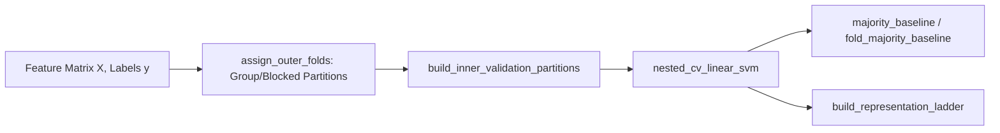

# 09. Population Decoding, Visual QC & Publication Graphics

This document details nested cross-validated population decoding, baselines, automated visual quality control (QC), and publication-ready vector graphic exports in `jnwb`.

---

## 1. Population Decoding & Nested Cross-Validation (`jnwb.decoding`)

`jnwb.decoding` provides linear support vector machine (SVM) decoders with nested cross-validation and fold partitioning schemes designed to prevent temporal autocorrelation leakage.



### Nested CV Linear SVM Decoding (`nested_cv_linear_svm`)

```python
import jnwb

# X: (n_samples, n_features) feature matrix
# labels: (n_samples,) integer condition labels
decode_res = jnwb.nested_cv_linear_svm(X, labels, n_splits=5)

print("Mean CV Accuracy:", decode_res["mean_accuracy"])
print("Confusion Matrix:\n", decode_res["confusion_matrix"])
```

### Baselines & Fold Partitions

```python
# Unconditioned majority class baseline
base_acc = jnwb.majority_baseline(labels)

# Fold-aware majority baseline
fold_acc = jnwb.fold_majority_baseline(y_train, y_test)

# Assign outer cross-validation folds preserving group integrity
outer_folds = jnwb.assign_outer_folds(labels, n_splits=5, groups=session_ids)

# Partition inner validation splits for hyperparameter tuning
inner_splits = jnwb.build_inner_validation_partitions(outer_folds)

# Evaluate cumulative feature ladder
ladder_res = jnwb.build_representation_ladder(X, labels, feature_names=feature_list)
```

---

## 2. Automated Electrophysiology Visual QC (`jnwb.visual_qc`)

`jnwb.visual_qc` generates standardized multi-panel figures for inspecting spike sorting fidelity, waveform stability, and noise distributions.

### Unit Waveform Pagination & Noise Diagnostics

```python
import jnwb

# Multi-panel distribution of Unit SNR, Firing Rates, and Isolation Distance
fig_dist = jnwb.visual_qc.plot_unit_quality_distribution(units_df, group_by="area")

# 2x2 Noise vs. Signal Diagnostic Panel
fig_noise = jnwb.visual_qc.plot_noise_vs_signal(lfp_segments, spike_trains)

# Multi-session QC comparison bars
fig_comp = jnwb.visual_qc.compare_session_quality(session_qc_list)
```

---

## 3. Publication Vector Graphics Standards (`jnwb.viz`)

### The Editable Vector Text Standard (`setup_vector_graphics`)

Standard matplotlib exports frequently convert text into non-editable paths. `jnwb.setup_vector_graphics` configures matplotlib rcParams for full text editability in Adobe Illustrator and Inkscape:

```python
import jnwb

# Call once at the start of a script or notebook
jnwb.setup_vector_graphics()
# Sets:
# - svg.fonttype = 'none' (preserves text as true SVG text elements)
# - pdf.fonttype = 42     (TrueType font embedding)
# - ps.fonttype = 42
```

### Tight Auto-Axis Bounding (`apply_tight_auto_axis`)

Eliminates dead margin whitespace while respecting physical domain non-negativity:

```python
import matplotlib.pyplot as plt

fig, ax = plt.subplots()
ax.plot(times_ms, firing_rate_hz)

# Set tight limits around active data span, with 5% margin, preserving non-negative rate floor
jnwb.apply_tight_auto_axis(ax, x=times_ms, y=firing_rate_hz, margin_pct=0.05, y_min_zero=True)
```

### Multi-Format Figure Suite Saving (`save_figure_suite`)

Saves figures atomically across multiple formats (SVG for layout, PDF for vector review, PNG for slide presentations) at 300+ DPI:

```python
jnwb.save_figure_suite(
    figures=[fig],
    output_dir="outputs/figures",
    basename="fig01_overview",
    formats=["png", "pdf", "svg"],
    dpi=300
)
```
