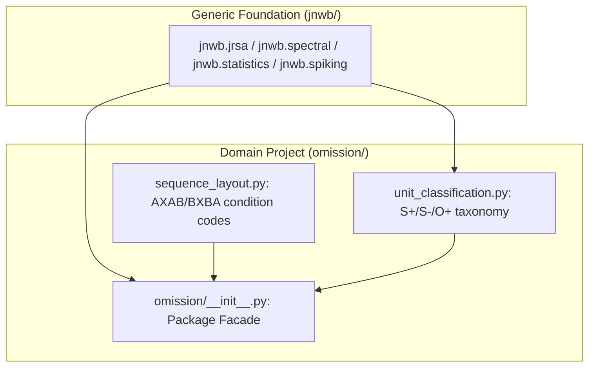

# 10. Extending `jnwb`, Project Facades & MCP Tooling

This document describes best practices for building domain-specific analysis pipelines on top of `jnwb`, structuring project facades, leveraging MCP tooling, and integrating automated verification gates.

---

## 1. Building Domain-Specific Projects on `jnwb`

`jnwb` is designed as the generic mathematical engine for high-level neurophysiology workflows.

### Architecture Pattern: The Domain Package Facade

When analyzing an experiment with unique trial sequences, task conditions, or unit taxonomy rules:
1. Keep `jnwb/` generic, frozen, and dataset-agnostic.
2. Build an experiment-specific package (e.g., `omission/`) that imports `jnwb` and exposes specialized functions.
3. Provide a unified package facade (e.g. `import omission as oa`) that surfaces both generic `jnwb` capabilities and project-specific extensions.



---

## 2. Model Context Protocol (MCP) Integration (`jnwb/mcp_server`)

`jnwb` includes built-in Model Context Protocol (MCP) server tooling in `jnwb/mcp_server` to allow AI agents and IDE tools to inspect NWB structures, query metadata, and compute analytical summaries programmatically.

### Key MCP Tools
- `read_nwb_metadata`: Inspects session headers, subject IDs, and electrode layouts.
- `query_units_by_area`: Fast structured lookup of units meeting firing rate and SNR thresholds.
- `compute_quick_psth`: Computes and serializes aligned PSTH arrays for instant inspection.

---

## 3. Automated Verification Gates & CI Infrastructure

To prevent architectural drift and coordinate corruption across collaborative workflows, `jnwb` relies on automated, deterministic gates:

### Automated Test Matrix
1. **Frozen Boundary Gate (`tests/test_jnwb_frozen_boundary.py`)**: Asserts that `jnwb` contains zero unauthorized imports from downstream project folders.
2. **Skill Tree Consolidation (`tests/test_skill_tree_consolidation.py`)**: Guards against duplicate or conflicting skill trees.
3. **Reproducibility Regressions (`tests/test_batch_a_regressions.py`)**: Asserts cross-process seed determinism, RNG isolation, and mathematical latency invariants.

### Running Verification Gates

```bash
# Execute pre-flight verification gate
python scripts/harness_gate.py

# Run full core test suite
pytest -v tests/
```
