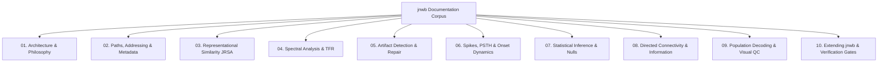

# `jnwb` Documentation Index

Welcome to the canonical technical documentation for **`jnwb`**, a dataset-agnostic Python library for large-scale Neurodata Without Borders (NWB 2.0+) electrophysiology analysis.

---

## Canonical Guide Architecture

### Table of Contents

1. [**01. Architecture & Design Philosophy**](01_architecture_and_philosophy.md)
   - Core philosophy: generic dataset-agnostic engine vs. domain-specific extensions.
   - Scientific invariants: Signal class independence, estimand disambiguation, causality vs. directionality.
   - Epistemic discipline: claim taxonomy and evidence precedence.

2. [**02. Paths, Addressing, Metadata & Ontology**](02_paths_addressing_metadata.md)
   - Dynamic path management and volume remap isolation (`paths`).
   - Spatial peak-channel-to-area and depth-to-layer addressing (`map_peak_channel_to_area`, `classify_layer_from_depth`, `enrich_units_dataframe`).
   - Unit quality classification, census reporting, and SNR auditing (`get_all_units_metadata`, `classify_unit_quality`, `unit_census_report`, `get_snr_analysis`, `filter_by_criteria`, `audit_units`, `audit_electrodes`, `assign_quality_tier`, `compare_old_new_criteria`, `old_new_summary_table`, `electrode_inventory`).
   - Query descriptors and ontology metadata (`Query`, `Dataset`, `AlignedDataset`, `Alignment`, `EpochCollection`, `Question`, `Result`, `Interpretation`, `Figure`, `Provenance`, `Lineage`).

3. [**03. Representational Similarity Analysis (JRSA)**](03_representational_similarity_jrsa.md)
   - Multivariate distance metrics (`jrsa`, 14 metrics spanning correlation, geometric, and information-theoretic distances).
   - Tensor alignments, sliding windows, and `JRSAResult` container objects.
   - GPU and CuPy hardware acceleration.

4. [**04. Spectral Analysis, Coherence & Time-Frequency Representations (TFR)**](04_spectral_analysis_and_tfr.md)
   - Canonical frequency bands (`CANONICAL_BANDS`), Welch PSD (`compute_psd`), and band power (`band_power`).
   - Cross-area coherence (`cross_area_coherence`), imaginary coherency (`imaginary_coherency`), spectral tilt (`spectral_tilt`), and harmonic analysis (`harmonic_analysis`).
   - Spatial referencing (`bipolar_reference`, `laplacian_reference`) and decibel conversion (`to_db`).
   - High-level analyzers (`TFRAnalyzer`, `UnitAnalyzer`, `PopulationAnalyzer`), streaming accumulation (`TFRAccumulator`, `assert_mergeable`), and quantization (`compress_fp32`).

5. [**05. Artifact Detection & Signal Repair**](05_artifact_detection_and_repair.md)
   - Channel correlation matrices (`channel_correlation_matrix`) and bad channel rejection (`bad_channels_from_correlation`).
   - Per-channel bad trial detection (`bad_trials_single_channel`, `trial_correlation_matrix`) and multi-channel consensus voting (`consensus_bad_trials`).
   - Cross-channel synchrony detection and cross-trial median substitution (`repair_lfp_trials`, `repair_band_artifacts`).

6. [**06. Spike Extraction, PSTH & Onset Dynamics**](06_spikes_psth_and_onset_dynamics.md)
   - Spike raster and PSTH binning (`raster_psth`, `resample_onsets`).
   - Response metrics (`compute_response_metrics`), significance classification (`classify_response_significance`), and spike-LFP phase locking (`phase_locking_index`).
   - Causal exponential smoothing (`causal_exp_smooth`), mathematical group delay, and latency hazards.
   - Causality-bounded exponential rise fitting (`fit_exponential_onset`, `onset_model`) and `bound_status` boundary censoring flags.
   - State-space population trajectories (`build_time_resolved_matrix`, `compute_population_trajectory`).

7. [**07. Statistical Inference, Resampling & Null Hypothesis Modeling**](07_statistical_inference_and_nulls.md)
   - Unified `StatisticalAnalysis` engine (isolated local RNG, bootstrap CIs, permutation tests, FDR control).
   - Standalone rate extraction (`rate_in_window`, `fires_in_window`, `fire_indicator`) and paired fire probability testing (`paired_fire_prob_test`).
   - Fast shuffle tests (`shuffle_pvalue_paired`, `shuffle_pvalue_unpaired`).
   - Grouped (`within_group`) vs. global exchangeability schemes (`permute_labels`, `build_permutation_plan`).
   - Periodic trial cycle detection (`detect_trial_cycles`, `assign_subblock_quartiles`, `shuffle_r2_ci`, `cross_modal_comparison`).

8. [**08. Directed Connectivity, Information Dynamics & Network Topology**](08_directed_connectivity_and_information.md)
   - Time-domain and spectral Granger causality (`granger`, `granger_spectral`, `granger_causality`).
   - Phase Slope Index (`phase_slope_index`) and Transfer Entropy (`transfer_entropy`).
   - Spike mutual information (`spike_mutual_information`, `spike_count_mutual_information`, `binary_occupancy_mutual_information`).
   - All-to-all directed networks (`directed_connectivity`, `directed_network`, `network_topology`, `as_trials`, `bin_spikes`, `DirectedResult`).

9. [**09. Population Decoding, Visual QC & Publication Graphics**](09_decoding_and_visual_qc.md)
   - Nested cross-validated linear SVM population decoding (`nested_cv_linear_svm`, `majority_baseline`, `fold_majority_baseline`, `assign_outer_folds`, `build_inner_validation_partitions`, `build_representation_ladder`).
   - Automated electrophysiology visual QC figures (`visual_qc`).
   - Editable vector graphics standards (`setup_vector_graphics`, TrueType font 42), tight auto-axis bounding (`apply_tight_auto_axis`), and multi-format figure saving suites (`save_figure_suite`).

10. [**10. Extending `jnwb`, Domain Packages & Verification Gates**](10_extending_jnwb_and_verification.md)
    - Domain package facade pattern (worked example: `omission/`).
    - Automated regression gates, boundary tripwires, and CI workflows.
    - Developer MCP tooling sidecars (`jnwb/mcp_server`).
