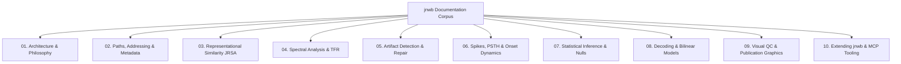

# `jnwb` Documentation Index

Welcome to the canonical technical documentation for **`jnwb`**, a dataset-agnostic Python library for large-scale Neurodata Without Borders (NWB 2.0+) electrophysiology analysis.

---

## Canonical Guide Architecture

### Table of Contents

1. [**01. Architecture & Design Philosophy**](01_architecture_and_philosophy.md)
   - Core philosophy: generic dataset-agnostic engine vs. domain-specific extensions.
   - Scientific invariants: Signal class independence, estimand disambiguation, causality vs. directionality, "Logarithm Last" rule.
   - Epistemic discipline: claim taxonomy and evidence precedence.

2. [**02. Paths, Addressing, Metadata & Ontology**](02_paths_addressing_metadata.md)
   - Dynamic path management and volume remap isolation (`paths.py`).
   - Spatial channel-to-area and laminar depth-to-layer addressing (`addressing.py`).
   - Unit quality classification, census reporting, and SNR auditing (`metadata.py`).
   - Query descriptors and event referencing (`ontology.py`).

3. [**03. Representational Similarity Analysis (JRSA)**](03_representational_similarity_jrsa.md)
   - Condition RDMs and pairwise distance estimators (Euclidean, Mahalanobis, Correlation, Cosine).
   - Linear model decomposition ($RDM_{\text{neural}} = \sum \beta_k RDM_k$).
   - Multi-lag temporal stacking and GPU / CuPy hardware acceleration.

4. [**04. Spectral Analysis, Coherence & Time-Frequency Representations (TFR)**](04_spectral_analysis_and_tfr.md)
   - Canonical frequency bands and multi-taper spectral estimation.
   - Cross-area coherence and Phase-Locking Value (PLV).
   - Coordinate-explicit band extraction (`TFRAnalyzer.extract_band`).
   - Streaming memory-efficient accumulation and quantization compression.

5. [**05. Artifact Detection & Signal Repair**](05_artifact_detection_and_repair.md)
   - Channel correlation matrices and bad channel rejection.
   - Per-channel bad trial detection and multi-channel consensus voting.
   - Cross-channel synchrony detection and cross-trial median substitution (`repair_lfp_trials`, `repair_band_artifacts`).

6. [**06. Spike Extraction, PSTH & Onset Dynamics**](06_spikes_psth_and_onset_dynamics.md)
   - Spike timestamp binning and PSTH generation.
   - Causal exponential smoothing, mathematical group delay, and latency hazards.
   - Causality-bounded exponential rise fitting and `bound_status` boundary censoring flags.
   - State-space population trajectory modeling.

7. [**07. Statistical Inference, Resampling & Null Hypothesis Modeling**](07_statistical_inference_and_nulls.md)
   - Local RNG injection, strict type validation, and global RNG isolation.
   - Parametric, non-parametric, and bootstrap mean-difference comparisons.
   - Benjamini-Hochberg False Discovery Rate (FDR) control.
   - Grouped (`within_group`) vs. global exchangeability schemes (`permute_labels`).
   - Paired binary fire probability testing.

8. [**08. Population Decoding, Multimodal Fusion & Bilinear Models**](08_decoding_and_bilinear_models.md)
   - Cross-validated population classification with contiguous block splitting.
   - Balanced multimodal latent feature fusion ($[PCA(X_S), PCA(X_L)]$).
   - Low-rank bilinear interaction decomposition and Neural Additive Models (NAM).

9. [**09. Visual QC & Publication-Ready Vector Graphics**](09_visual_qc_and_publication_graphics.md)
   - Multi-unit waveform pagination, SNR scatter distributions, and noise diagnostics.
   - Editable vector text standards (`setup_vector_graphics`, TrueType font 42).
   - Dynamic tight auto-axis bounding and multi-format figure saving suites.

10. [**10. Extending `jnwb`, Project Facades & MCP Tooling**](10_extending_jnwb_and_mcp.md)
    - Domain package facade pattern (worked example: `omission/`).
    - Model Context Protocol (MCP) server tooling (`jnwb/mcp_server`).
    - Automated regression gates, boundary tripwires, and CI workflows.
