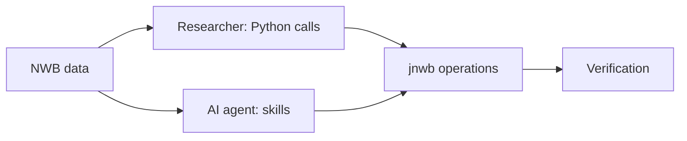
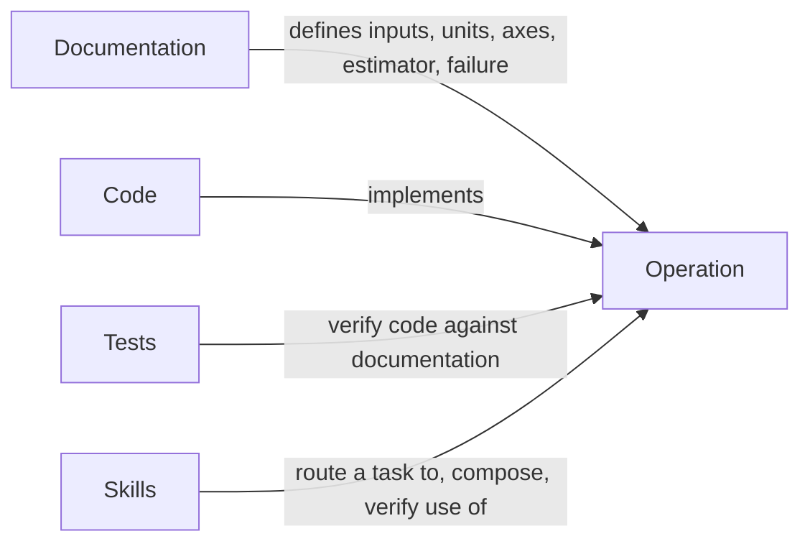
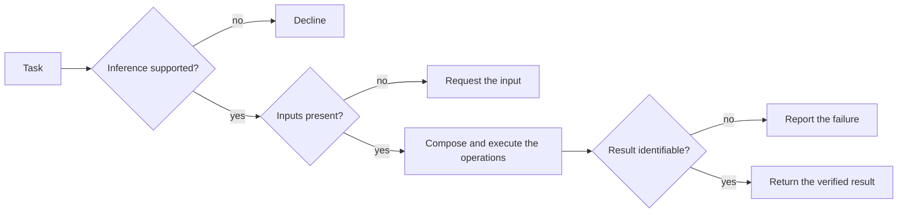
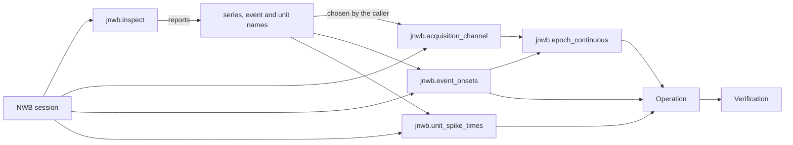
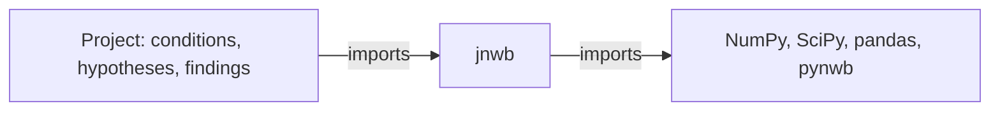

# Architecture

jnwb is a Python toolbox for analyzing Neurodata Without Borders (NWB) datasets, built to be
called directly by researchers and composed by AI agents.

## Two entry paths

Researchers and agents reach the same operations by parallel paths, and both end in the same
verification:

A researcher never passes through the agent layer: the package is complete without it. A
researcher starts at the [Quickstart](quickstart.md); an agent starts at
[Analyzing with an Agent](agents.md).

## Core and skills

The core is the operations, their documentation and the tests that verify them; `pip install
jnwb` installs the operations, and the documentation and tests live in the source repository.
Skills are a routing layer over the core.

Code, documentation and tests constrain each other, so none of the three changes alone. Skills
sit outside that relation and act on it. A skill names an operation and quotes its call
signature; the documentation defines it, and a test checks every quoted signature against the
code, so a skill carries no second copy of the operation's scientific interface.

## Routing outcomes

Every task a skill receives ends in one of four outcomes:

The skill decides how; the tested operation computes what. A failed estimate is never turned
into a plausible finite number or label, and an unsupported question is never turned into a
supported-looking answer. Declining is a correct outcome. The library's own refusals, and what
to pass instead, are listed on [Errors](errors.md).

`jnwb.preflight(question)` runs the checks before execution on a plan written as a
`jnwb.Question`, in the order drawn above, and returns a `Preflight` whose `outcome`, `reason`
and `missing` a script can score. The caller declares an unsupported inference
(`unsupported_inference`) or a non-identifiable result (`non_identifiable`); the required inputs
are `signals`, `signal_units`, `contrast` and `inference_unit`.

## From NWB file to result

`jnwb.inspect` reports what a session holds. The loaders read the chosen series, events and
units; continuous data is cut into trials around the event onsets before an operation runs.

## What belongs in jnwb

jnwb owns generic, testable operations. Study-specific conditions, hypotheses and interpretation
stay in the project that uses jnwb. The dependency runs one way:

jnwb imports nothing from a project and behaves identically whether one is installed or absent.
An operation belongs in jnwb when all five hold:

| Criterion | Holds when |
|---|---|
| Generic | it is not about one dataset's structure |
| Dataset-independent | it names no study, session or condition |
| Scientifically stable | its definition does not move with a hypothesis |
| Explicitly parameterized | every scientific choice is a caller input, not a default in hiding |
| Independently testable | it can be verified without the study that motivated it |

A question that existing operations answer in composition gets a composition, and new code is
written only for a missing generic capability.

[Philosophy & Boundary](01_architecture_and_philosophy.md) maps the modules, the one-way
dependency on downstream projects, and the scientific invariants every operation keeps.
