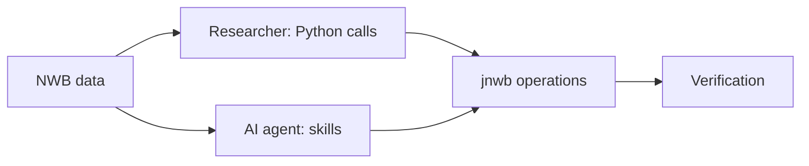

# Architecture

jnwb is a Python toolbox for analyzing Neurodata Without Borders (NWB) datasets, built to be
called directly by researchers and composed by AI agents.

## Two entry paths

Researchers and agents reach the same operations by parallel paths, and both end in the same
verification:

A researcher never passes through the agent layer: the package is complete without it. A
researcher starts at the [Quickstart](quickstart.md); an agent starts at
[Analyzing with an Agent](agents.md).

## Core and skills

The core is what `pip install jnwb` installs: the operations, their documentation and the tests
that verify them. Skills are a routing layer over the core and add no second copy of its
scientific interface.

| Part | Role |
|---|---|
| Code | implements each operation |
| Documentation | defines each operation: inputs, units, axes, estimator, failure behavior |
| Tests | verify that the code does what the documentation defines |
| Skills | route a task to operations, then discover, constrain, compose, execute and verify their use |

Code, documentation and tests constrain each other, so none of the three changes alone. Skills
sit outside that relation and act on it. A skill names an operation; the documentation defines
it, so a skill restates neither a signature nor the mathematics.

## Routing outcomes

Every task a skill receives ends in one of four outcomes:

| Task | Outcome |
|---|---|
| Supported | compose the operations and execute them |
| Missing input | request the input |
| Result not identifiable | report the failure |
| Unsupported inference | decline |

The skill decides how; the tested operation computes what. A failed estimate is never turned
into a plausible finite number or label, and an unsupported question is never turned into a
supported-looking answer. Declining is a correct outcome. The library's own refusals, and what
to pass instead, are listed on [Errors](errors.md).

## What belongs in jnwb

jnwb owns generic, testable operations. Study-specific conditions, hypotheses and interpretation
stay in the project that uses jnwb. An operation belongs in jnwb when all five hold:

| Criterion | Holds when |
|---|---|
| Generic | it is about NWB data in general, not one dataset's structure |
| Dataset-independent | it names no study, session or condition |
| Scientifically stable | its definition does not move with a hypothesis |
| Explicitly parameterized | every scientific choice is an explicit caller input |
| Independently testable | it can be verified without the study that motivated it |

A question that existing operations answer in composition gets a composition, and new code is
written only for a missing generic capability.

[Philosophy & Boundary](01_architecture_and_philosophy.md) maps the modules, the one-way
dependency on downstream projects, and the scientific invariants every operation keeps.
