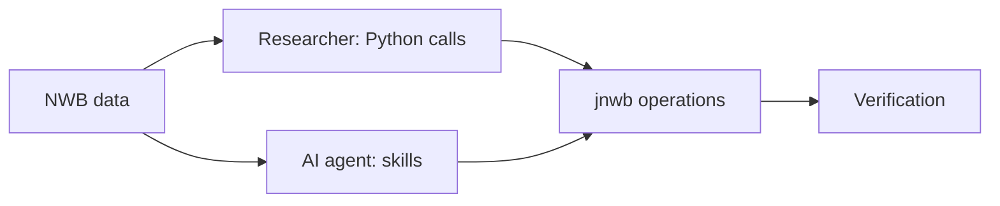
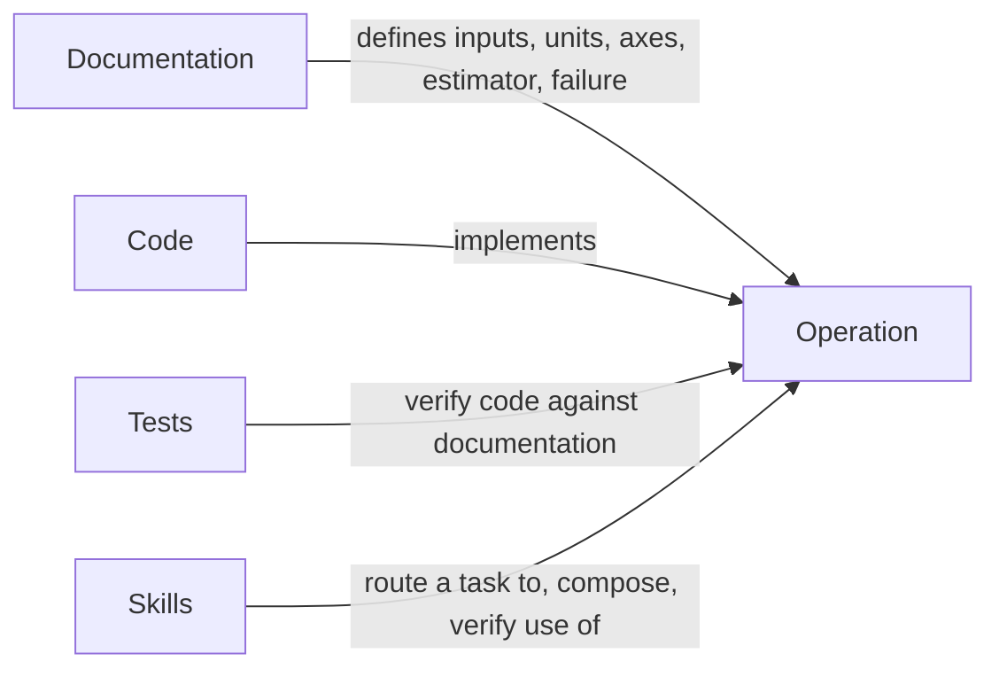
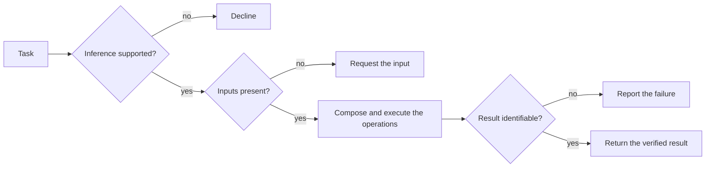
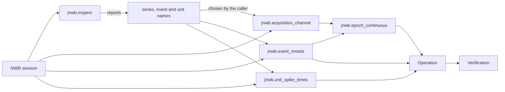
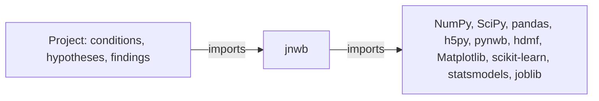

# Architecture

jnwb is a Python toolbox for analyzing Neurodata Without Borders (NWB) datasets, built to be
called directly by researchers and composed by AI agents. This page covers the two entry paths,
the package boundary, the scientific invariants every operation keeps, and the module map.

## Two entry paths

Researchers and agents reach the same operations by parallel paths, and both end in the same
verification:

```mermaid
graph LR
    NWB[NWB data] --> R[Researcher: Python calls]
    NWB --> A[AI agent: skills]
    R --> O[jnwb operations]
    A --> O
    O --> V[Verification]
```

A researcher never passes through the agent layer: the package is complete without it. A
researcher starts at the [Quickstart](quickstart.md); an agent starts at
[Analyzing with an Agent](agents.md).

## Core and skills

The core is the operations, their documentation and the tests that verify them; `pip install
jnwb` installs the operations, and the documentation and tests live in the source repository.
Skills are a routing layer over the core.

```mermaid
graph LR
    D[Documentation] -->|defines inputs, units, axes, estimator, failure| O[Operation]
    C[Code] -->|implements| O
    T[Tests] -->|verify code against documentation| O
    S[Skills] -->|route a task to, compose, verify use of| O
```

Code, documentation and tests constrain each other, so none of the three changes alone. Skills
sit outside that relation and act on it. A skill names an operation and quotes its call
signature; the documentation defines it, and a test checks every quoted signature against the
code, so a skill carries no second copy of the operation's scientific interface.

## Routing outcomes

Every task a skill receives ends in one of four outcomes:

```mermaid
flowchart LR
    Q[Task] --> S{Inference supported?}
    S -->|no| DC[Decline]
    S -->|yes| I{Inputs present?}
    I -->|no| RQ[Request the input]
    I -->|yes| X[Compose and execute the operations]
    X --> ID{Result identifiable?}
    ID -->|no| RF[Report the failure]
    ID -->|yes| RS[Return the verified result]
```

The skill decides how; the tested operation computes what. A failed estimate is never turned
into a plausible finite number or label, and an unsupported question is never turned into a
supported-looking answer. Declining is a correct outcome. The library's own refusals, and what
to pass instead, are listed on [Errors](errors.md).

`jnwb.preflight(question)` runs the checks before execution on a plan written as a
`jnwb.Question`, in the order drawn above, and returns a `Preflight` whose `outcome`, `reason`
and `missing` a script can score. The caller declares an unsupported inference
(`unsupported_inference`) or a non-identifiable result (`non_identifiable`); the required inputs
are `signals`, `signal_units`, `contrast` and `inference_unit`.

## From NWB file to result

`jnwb.inspect` reports what a session holds. The loaders read the chosen series, events and
units; continuous data is cut into trials around the event onsets before an operation runs.
How jnwb reads the file itself is on [Reading NWB Data](reading_nwb.md).

```mermaid
graph LR
    F[NWB session] --> I[jnwb.inspect]
    I -->|reports| N[series, event and unit names]
    F --> A[jnwb.acquisition_channel]
    F --> E[jnwb.event_onsets]
    F --> U[jnwb.unit_spike_times]
    N -->|chosen by the caller| A
    N --> E
    N --> U
    A --> EP[jnwb.epoch_continuous]
    E --> EP
    E --> O[Operation]
    U --> O
    EP --> O
    O --> V[Verification]
```

## What belongs in jnwb

jnwb owns generic, testable operations. Study-specific conditions, hypotheses and interpretation
stay in the project that uses jnwb. `jnwb` keeps two things apart:

1. **Generic Electrophysiology Operations (`jnwb/`)**: Signal processing, time-frequency representations, representational similarity analysis (JRSA), artifact detection/repair, spike extraction, onset latency modeling, directed connectivity, decoding, and statistical null hypothesis testing.
2. **Project-Specific Domain Extensions**: Task structures, custom condition codes, sequence slot timings, and project-specific unit classification taxonomies.

The dependency runs one way:

```mermaid
graph LR
    P[Project: conditions, hypotheses, findings] -->|imports| J[jnwb]
    J -->|imports| L[NumPy, SciPy, pandas, h5py, pynwb, hdmf, Matplotlib, scikit-learn, statsmodels, joblib]
```

Project-specific extensions and manuscript findings live in downstream project packages, which
import `jnwb`. jnwb imports nothing from them, a regression gate enforces it, and jnwb behaves
identically whether a project is installed or absent. An operation belongs in jnwb when all five
hold:

| Criterion | Holds when |
|---|---|
| Generic | it is not about one dataset's structure |
| Dataset-independent | it names no study, session or condition |
| Scientifically stable | its definition does not move with a hypothesis |
| Explicitly parameterized | every scientific choice is a caller input, not a default in hiding |
| Independently testable | it can be verified without the study that motivated it |

A question that existing operations answer in composition gets a composition, and new code is
written only for a missing generic capability.

## Scientific invariants

### Signal class independence
* **Physical Classes**: Spikes (SUA/MUA), Multi-unit activity envelopes (MUAe), Local Field Potentials (LFP), and behavioral covariates are distinct observables.
* **No Modality Pooling**: Signals of distinct modalities are never pooled; spikes and LFP are never pooled.

### Estimand disambiguation
Each estimator computes one estimand:
$$\text{Prevalence} \neq \text{Magnitude} \neq \text{Information} \neq \text{Mechanism}$$
* **Prevalence**: Fraction of responsive or selective units/channels in a population.
* **Magnitude**: Absolute or normalized effect size (e.g., $\Delta\text{Hz}$, $\Delta\text{dB}$, SNR).
* **Information**: Decodability or mutual information in state space.
* **Mechanism**: Circuit-level causal drivers.

### Causal and directional verbs
$$\text{Association} \neq \text{Directionality} \neq \text{Causality}$$
* Linear correlation and mutual information establish non-directional association.
* Granger causality, phase slope index, and transfer entropy establish statistical temporal predictability.
* Perturbational manipulations (optogenetics, pharmacology, lesions) establish physical causality. A weaker result is never described with a stronger causal verb.

A coupling estimate supports one of four claims, weakest first, and is reported in the words of
its own row:

| Claim | What it states | What jnwb estimates it with | What it does not license |
|---|---|---|---|
| Magnitude | how strongly two signals are coupled, without a sign | correlation, mutual information, `cross_area_coherence`, `wpli` | a direction: unsigned coupling does not determine which signal leads |
| Direction | which signal leads, as a lag asymmetry | `granger`, `phase_slope_index`, `transfer_entropy`, the sign of `imaginary_coherency` | a delay in seconds, or that one site drives another |
| Delay | a time offset in seconds, and with contact spacing an apparent velocity | `zflip`, only when the phase is linear and unwrapped across the fitted band and each identifiability criterion passes; `NaN` otherwise | a conduction velocity: two sources with a fixed phase offset, a traveling wave or volume conduction give the same gradient |
| Inference | a physical cause, or an effect across a population | none for a cause, which takes a perturbation; a population effect takes its declared unit of inference and a valid null, below | a cause from any row above |

[Addressing & Metadata](02_paths_addressing_metadata.md) states the delay criteria for `zflip`,
and [Directed Connectivity](08_directed_connectivity_and_information.md) the direction estimators.

### Mathematical and analysis-specific conventions
* `jnwb` provides generic mathematical transforms (e.g. `to_db(ratio) = 10 * log10(ratio)`, `compute_psd`, `band_power`).
* The logarithm comes last: `aggregate_to_db` owns the ratio-aggregate-log sequence and makes the caller name the estimand (`how="mean_of_ratios"` or `"ratio_of_means"`).

### Unit of inference and hierarchical structure
* Statistical tests and degrees of freedom must declare their exact inferential unit: unit, channel, trial, or session/subject.
* When trials nest within sessions or subjects, exchangeability schemes (`within_group` permutations, grouped CV) must respect that structure; hierarchical or cluster-bootstrap analyses are the project's choice when the inferential unit is above the trial.

### Valid nulls and no synthetic science
* A null finding ($p \ge \alpha$) is an observation, not an error. Parameters, frequency bands and windows are never retrofitted to reach significance.
* Outputs hold no synthetic or placeholder values. Synthetic signals exist for verification, in `jnwb.testing`, and are never presented as measurements.

## Module Map

| Module | Core Responsibility | Primary Public Symbols in `jnwb.__all__` |
|--------|---------------------|------------------------------------------|
| `paths` | Data root discovery & volume remap management | `paths` |
| `nwb_inspect` | NWB file discovery: acquisitions, units, electrodes and interval tables | `inspect`, `unit_spike_times`, `acquisition_channel`, `resolve_acquisition` |
| `nwb_events` | Event codes and onsets from a named interval table | `events`, `event_onsets`, `resolve_interval_table`, `EventTable` |
| `nwb_io` | NWB reads with scoped builder repairs; a missing required field is refused unless named in `allow_missing` | `read_nwb`, `nwb_read_io`, `MissingRequiredNWBFieldError`, `SqueezedAttributeWarning` |
| `continuous` | Epoching a continuous signal around event onsets | `epoch_continuous` |
| `io` | Slices of NPZ arrays read without loading the whole archive | `io`, `stream_npz_array` |
| `addressing` | Spatial channel-to-area addressing and a geometric depth class | `map_peak_channel_to_area`, `classify_layer_from_depth`, `enrich_units_dataframe` |
| `metadata` | Unit quality classification, census, & SNR auditing | `get_all_units_metadata`, `classify_unit_quality`, `unit_census_report`, `get_snr_analysis`, `filter_by_criteria`, `audit_units`, `audit_electrodes`, `assign_quality_tier`, `electrode_inventory` |
| `unit_quality` | Waveform and spike-train quality measures of one sorted unit | `waveform_features`, `waveform_snr`, `waveform_flatness`, `spatial_derivative_sharpness`, `presence_ratio`, `isi_cv`, `refractory_contamination` |
| `filtering` | Zero-phase & causal Butterworth bandpass and notch SOS filters | `bandpass_filter`, `notch_filter` |
| `ontology` | Structured query objects and event referencing | `Query`, `Dataset`, `AlignedDataset`, `Alignment`, `EpochCollection`, `Question`, `Result`, `Interpretation`, `Figure`, `Provenance`, `Lineage` |
| `jrsa` | Representational Similarity Analysis (RDMs, metrics) | `jrsa`, `JRSAResult` |
| `rsa` | Representational dissimilarity matrices and their comparison | `rdm`, `rdm_similarity` |
| `spectral` | Multi-taper spectral analysis, coherence, CSD, and PLV | `compute_psd`, `compute_multitaper_psd`, `band_power`, `spectral_tilt`, `voltage_curvature_1d`, `current_source_density_1d`, `harmonic_analysis`, `imaginary_coherency`, `cross_area_coherence`, `bipolar_reference`, `laplacian_reference`, `to_db`, `CANONICAL_BANDS` |
| `tfr` | Complex Morlet time-frequency representation | `complex_tfr`, `morlet_wavelet`, `ComplexTFR` |
| `laminar` | Depth profiles along a probe shaft from spectra, correlation blocks and phase gradients, and layer labels from an accepted profile | `vflip`, `vflip_from_lfp`, `xflip`, `zflip`, `label_layers`, `VFlipResult`, `XFlipResult`, `ZFlipResult` |
| `laminar_curation` | Bad contacts, interpolation, evoked CSD sink and graded layer labels for a laminar LFP recording | `detect_bad_channels`, `interpolate_channel_runs`, `evoked_csd_sink`, `fuse_laminar_anchors`, `curate_and_label`, `LaminarCurationResult` |
| `tfr_accumulator` | Streaming trial-wise TFR accumulation | `TFRAccumulator`, `assert_mergeable` |
| `compression` | NWB on-disk fp32 conversion (`compress_fp32` path I/O) | `compress_fp32` |
| `analyzers` | High-level session analyzers | `TFRAnalyzer`, `UnitAnalyzer`, `PopulationAnalyzer` |
| `connectivity` | Directed connectivity, Granger, PSI, Transfer Entropy, MI | `granger`, `granger_spectral`, `granger_causality`, `phase_slope_index`, `transfer_entropy`, `directed_connectivity`, `directed_network`, `network_topology`, `spike_mutual_information`, `spike_count_mutual_information`, `binary_occupancy_mutual_information`, `bin_spikes`, `as_trials`, `DirectedResult` |
| `artifact_detection` | Channel and trial correlation matrix artifact detection | `channel_correlation_matrix`, `bad_channels_from_correlation`, `trial_correlation_matrix`, `bad_trials_single_channel`, `consensus_bad_trials` |
| `artifact_repair` | Cross-channel synchrony & cross-trial median repair | `repair_lfp_trials`, `repair_band_artifacts` |
| `spiking` | Spike metrics, significance testing, phase locking & PPC | `compute_response_metrics`, `classify_response_significance`, `phase_locking_index`, `pairwise_phase_consistency`, `gaussian_smooth_rate` |
| `onset_fitting` | Causal exponential smoothing & bounded onset latency fitting | `causal_exp_smooth`, `fit_exponential_onset`, `onset_model` |
| `trajectory` | State-space neural population trajectories | `build_time_resolved_matrix`, `compute_population_trajectory` |
| `statistics` | Bootstrap CIs, permutation nulls, paired fire tests, cluster tests, FDR | `StatisticalAnalysis`, `rate_in_window`, `fires_in_window`, `fire_indicator`, `paired_fire_prob_test`, `shuffle_pvalue_paired`, `shuffle_pvalue_unpaired`, `cluster_permutation_test`, `detect_trial_cycles`, `assign_subblock_quartiles`, `shuffle_r2_ci`, `cross_modal_comparison` |
| `permutation` | Grouped (`within_group`) and global label permutation | `permute_labels`, `build_permutation_plan` |
| `decoding` | Nested cross-validated linear SVM population decoding | `nested_cv_linear_svm`, `majority_baseline`, `fold_majority_baseline`, `assign_outer_folds`, `build_inner_validation_partitions`, `build_representation_ladder` |
| `visual_qc` | Multi-panel unit waveform and session QC figures | `visual_qc` |
| `viz` | Publication vector graphics standards & multi-panel saving | `setup_vector_graphics`, `apply_tight_auto_axis`, `save_figure_suite`, `resample_onsets`, `raster_psth` |
| `vis` | Plotly figures; needs the optional `vis` extra ([Plotly Figures](vis.md)) | `vis` |
