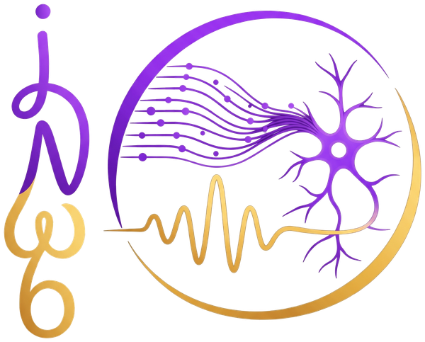
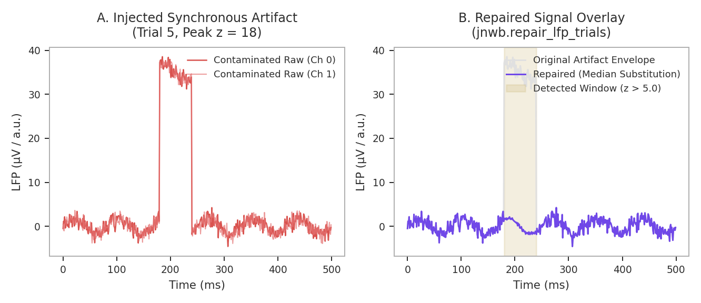
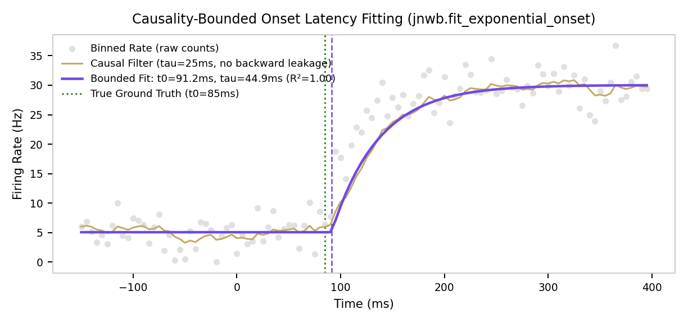
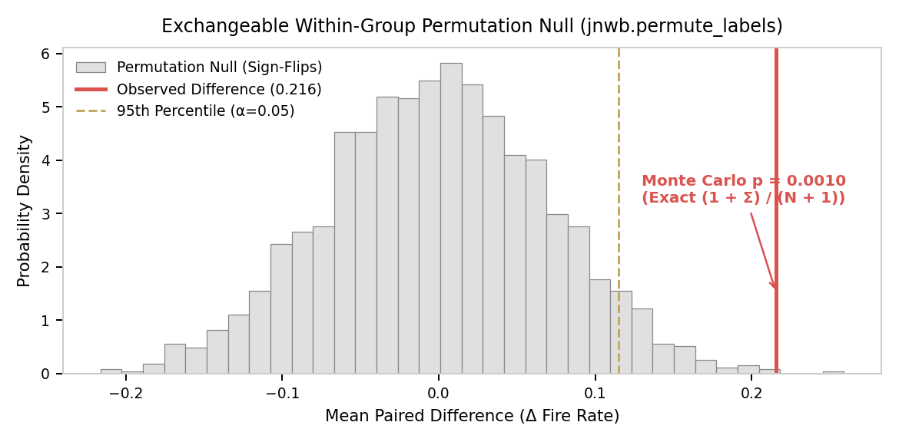
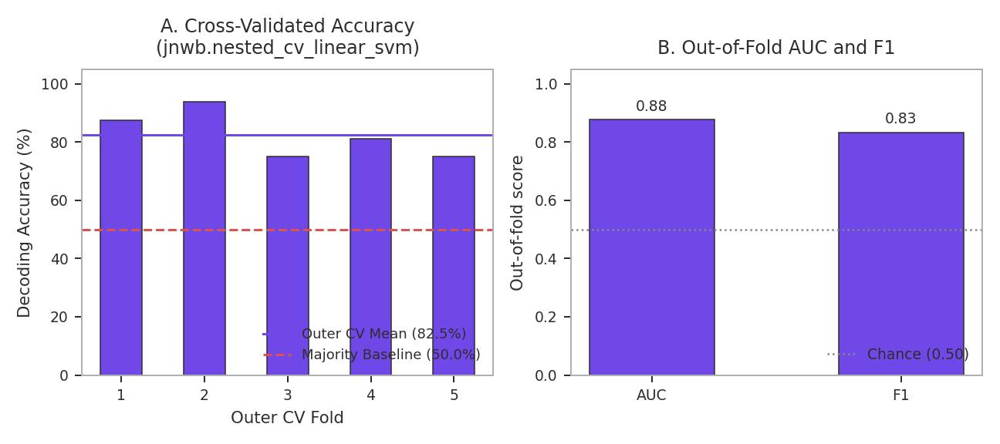

<p align="center">
  
</p>

# jnwb

**Version {{ jnwb_version }}**

Dataset-agnostic Python library for Neurodata Without Borders (NWB 2.0+) electrophysiology: addressing, spikes, LFP, spectral analysis, statistics, population methods, decoding, connectivity, laminar CSD, filtering, QC, and visualization.

Condition codes, task structure, and experimental hypotheses belong in project code. The library operates on NWB files, numeric arrays, and metadata tables.

[Architecture](01_architecture_and_philosophy.md) · [Public API](api.md) (every exported symbol) · [Common mistakes](common_mistakes.md)

## Install

```bash
pip install -U jnwb
pip install "jnwb[torch,gpu]"   # optional CuPy / PyTorch
```

Requires Python 3.12 or newer; CI tests 3.12 and 3.14. See [Installation](install.md).

## Example

Welch PSD and canonical-band power on a synthetic oscillation:

```python
import jnwb
import numpy as np

rng = np.random.default_rng(0)
fs = 1000.0
time = np.arange(1000) / fs
signal = np.sin(2 * np.pi * 20.0 * time) + 0.5 * rng.normal(size=1000)

freqs, psd = jnwb.compute_psd(signal, fs=fs)
beta_power = jnwb.band_power(signal, fs=fs, freq_range=(14.0, 30.0))
print(f"Beta band power: {beta_power:.4f}")
```

## Guides

- [Quickstart](quickstart.md) — runnable tour of core primitives
- [Installation](install.md) — setup and verification
- [Architecture](01_architecture_and_philosophy.md) — scope, units, and dataset independence
- [Addressing & metadata](02_paths_addressing_metadata.md)
- [Public API](api.md) — every symbol in `jnwb.__all__`, gate-enforced
- [Interactive analyses](12_interactive_analyses.md) — hosted analysis atlas (separate from this package docs)
## Figures

Synthetic, deterministic examples generated by `docs/generate_figures.py` from public APIs:

<table>
  <tr>
    <td align="center" width="50%">
      
      <sub>Artifact detection and trial repair</sub>
    </td>
    <td align="center" width="50%">
      
      <sub>Morlet TFR and cone of influence</sub>
    </td>
  </tr>
  <tr>
    <td align="center" width="50%">
      
      <sub>Directed connectivity</sub>
    </td>
    <td align="center" width="50%">
      
      <sub>PSTH and exponential onset fit</sub>
    </td>
  </tr>
  <tr>
    <td align="center" width="50%">
      
      <sub>Permutation nulls</sub>
    </td>
    <td align="center" width="50%">
      
      <sub>Nested-CV linear decoding</sub>
    </td>
  </tr>
</table>
