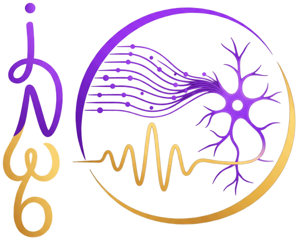

<p align="center">
  
</p>

# jnwb

**Version {{ jnwb_version }}**

Dataset-agnostic Python library for Neurodata Without Borders (NWB 2.0+) electrophysiology: addressing, spikes, LFP, spectral analysis, statistics, population methods, decoding, connectivity, laminar CSD, filtering, QC, and visualization.

Condition codes, task structure, and experimental hypotheses belong in project code. The library operates on NWB files, numeric arrays, and metadata tables.

**New to NWB in jnwb?** Start with the [Tutorials](tutorials/01_nwb_basics.md):
`inspect` → `events` / `event_onsets` → align spikes/LFP → compose an analysis.

## Install

```bash
pip install -U jnwb
pip install "jnwb[torch,gpu]"   # optional CuPy / PyTorch
```

Requires Python 3.12 or newer; CI tests 3.12, 3.13 and 3.14. See [Installation](install.md).

## Example

Welch PSD and canonical-band power on a synthetic oscillation:

```python
import jnwb
import numpy as np

rng = np.random.default_rng(0)
fs = 1000.0
time = np.arange(1000) / fs
signal = np.sin(2 * np.pi * 20.0 * time) + 0.5 * rng.normal(size=1000)

freqs, psd = jnwb.compute_psd(signal, fs=fs)
beta_power = jnwb.band_power(
    signal, fs=fs, freq_range=(14.0, 30.0), normalize=False,
)
print(f"Beta band power: {beta_power:.4f}")
```

## Guides

- [Quickstart](quickstart.md) — runnable tour of core operations
- [Installation](install.md) — setup and verification
- [Architecture](architecture.md) — the two entry paths, how skills route, and what belongs in jnwb
- [Philosophy & boundary](01_architecture_and_philosophy.md) — scope, units, and dataset independence
- [Addressing & metadata](02_paths_addressing_metadata.md)
- [Public API](api.md) — every symbol in `jnwb.__all__`
- [Common mistakes](common_mistakes.md) — the failure modes jnwb guards against
- [Errors](errors.md) — what each refusal means and what to pass instead
- [Analyzing with an agent](agents.md) — what ships, the MCP server, and the skills
- [References](references.md) — published sources for each method

## Figures

Synthetic, deterministic examples generated by `docs/generate_figures.py` from public APIs:

<table>
  <tr>
    <td align="center" width="50%">
      <a href="05_artifact_detection_and_repair/"></a>
      <a href="05_artifact_detection_and_repair/"></a>
      <sub>Artifact detection and trial repair (<code>repair_lfp_trials</code>)</sub>
    </td>
    <td align="center" width="50%">
      <a href="04_spectral_analysis_and_tfr/"></a>
      <a href="04_spectral_analysis_and_tfr/"></a>
      <sub>Morlet TFR and cone of influence (<code>complex_tfr</code>)</sub>
    </td>
  </tr>
  <tr>
    <td align="center" width="50%">
      <a href="08_directed_connectivity_and_information/"></a>
      <a href="08_directed_connectivity_and_information/"></a>
      <sub>Directed connectivity (<code>granger</code>, <code>phase_slope_index</code>)</sub>
    </td>
    <td align="center" width="50%">
      <a href="06_spikes_psth_and_onset_dynamics/"></a>
      <a href="06_spikes_psth_and_onset_dynamics/"></a>
      <sub>Exponential onset fit (<code>fit_exponential_onset</code>)</sub>
    </td>
  </tr>
  <tr>
    <td align="center" width="50%">
      <a href="07_statistical_inference_and_nulls/"></a>
      <a href="07_statistical_inference_and_nulls/"></a>
      <sub>Sign-flip null (<code>exact_sign_flip</code>, <code>permute_labels</code>)</sub>
    </td>
    <td align="center" width="50%">
      <a href="09_decoding_and_visual_qc/"></a>
      <a href="09_decoding_and_visual_qc/"></a>
      <sub>Nested-CV linear decoding (<code>nested_cv_linear_svm</code>)</sub>
    </td>
  </tr>
</table>
