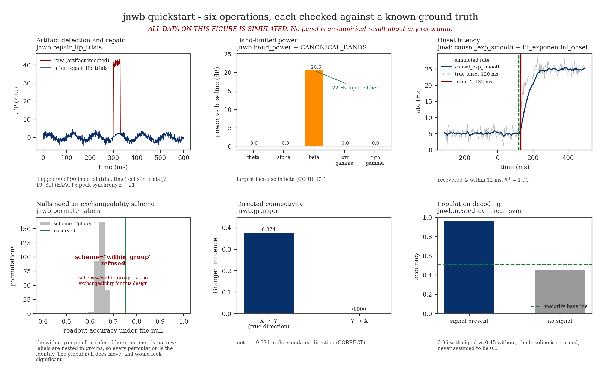

# Quickstart

Study **electrophysiology and NWB 2.0+ datasets** — trial-level artifact repair, time-frequency dynamics, directed information flow, single-unit spiking latencies, and cross-modal representational similarity — with dataset-agnostic, mathematically verified algorithms.

> Documentation tracks the `dev` branch public contract. Every primitive operates on array representations or NWB structures without experiment-specific assumptions.

## Install & Import

```bash
pip install jnwb
```

```python
import jnwb
import numpy as np
```

## Which Workflow Should I Use?

Pick the appropriate pipeline module for your analytical question:

| Goal | Primary entry points | Core function / class | Output type |
|------|---------------------|------------------------|-------------|
| **Trial QC & cleaning** | `jnwb.repair_lfp_trials`, `jnwb.bad_channels_from_correlation` | artifact repair + detection | `tuple`, masks |
| **Spectral dynamics** | `jnwb.complex_tfr`, `jnwb.compute_multitaper_psd` | TFR + PSD | `ComplexTFR`, arrays |
| **Directed interaction** | `jnwb.phase_slope_index`, `jnwb.granger` | PSI, Granger | `DirectedResult` |
| **Spiking & latencies** | `jnwb.raster_psth`, `jnwb.fit_exponential_onset` | PSTH + onset fit | arrays, `dict` |
| **Hypothesis testing** | `jnwb.paired_fire_prob_test`, `jnwb.permute_labels` | paired test + permutation | `dict` |
| **Representational geometry** | `jnwb.jrsa` | jRSA | `JRSAResult` |

---

## Executable quickstart script (6-panel figure)

`examples/quickstart_jnwb.py` is the authoritative smoke test: band power, label permutation, Granger causality, and nested-CV decoding on synthetic data, rendered as a six-panel figure.



Run the complete quickstart script locally:

```bash
python examples/quickstart_jnwb.py
```

---

## Markdown API tour (extended examples)

The steps below are a separate, documentation-first walkthrough (artifact repair, TFR, PSI, jRSA). They are **not** the same panels as `examples/quickstart_jnwb.py`; run the script when you need the figure smoke test.

## Step-by-Step Tour

### 1. Artifact Detection & Repair

Detect and interpolate high-amplitude transients across multichannel LFP arrays without corrupting unaffected channels or neighboring time windows:

```python
rng = np.random.default_rng(0)
n_trials, n_ch, n_t = 40, 8, 600
t = np.arange(n_t)
seg = rng.normal(0, 1, (n_trials, n_ch, n_t))
seg += 2.0 * np.sin(2 * np.pi * 10 * t / 1000.0)

# Inject synchronous transient artifact on specific trials
for trial_idx in [7, 19, 31]:
    seg[trial_idx, :, 300:330] += 40.0

repaired, frac, diag = jnwb.repair_lfp_trials(seg, times_ms=t, z_thresh=6.0)
print(f"Repaired fraction: {frac:.1%}")
```

### 2. Time-Frequency Dynamics (Complex Morlet TFR)

Extract phase and power with single-trial resolution using Morlet wavelets:

```python
freqs = np.linspace(6.0, 45.0, 30)
tfr = jnwb.complex_tfr(repaired[0], fs=1000.0, freqs=freqs, n_cycles=5.0)

print(f"TFR shape (channels, freqs, time): {tfr.shape}")
print(f"Mean raw power: {tfr.power.mean():.4f}")
```

### 3. Directed Information Flow (Phase Slope Index)

Compute robust, phase-slope directionality between two time series with phase-randomized surrogate significance testing:

```python
sig_a = rng.normal(size=1000)
sig_b = np.roll(sig_a, 5) + 0.5 * rng.normal(size=1000)

psi = jnwb.phase_slope_index(sig_a, sig_b, fs=1000.0, bands=(8.0, 30.0), n_surrogates=50, seed=0)
print(f"PSI X->Y: {psi.x_to_y:.4f}, p-value: {psi.p_x_to_y:.4f}")
```

### 4. Spiking PSTH & Onset Dynamics

Calculate peristimulus time histograms with bootstrap confidence intervals and fit parametric latency models:

```python
spk_times = np.sort(rng.uniform(0, 10, 200))
event_onsets = np.array([1.0, 3.0, 5.0, 7.0])

time_bins, rate, sem = jnwb.raster_psth(spk_times, event_onsets, win_ms=(-100.0, 400.0), bin_ms=10.0)
onset_fit = jnwb.fit_exponential_onset(time_bins, rate, t0_bounds=(0.0, 250.0))
print(f"Estimated latency t0: {onset_fit['t0']:.2f} ms (status: {onset_fit['bound_status']})")
```

### 5. Non-Parametric Statistical Testing

Evaluate trial-level event comparisons using stratified shuffle permutations:

```python
fires_cond_a = np.array([True, True, False, True, False, True, True, False])
fires_cond_b = np.array([False, False, False, True, False, False, False, False])

stat_res = jnwb.paired_fire_prob_test(
    fires_cond_a, fires_cond_b, n_shuffles=500, n_bootstrap=500, rng=rng
)
print(
    f"Risk difference: {stat_res['risk_difference']:.3f}, "
    f"p-value: {stat_res['p_value_fire_shuffle']:.4f}"
)
```

### 6. Joint Representational Similarity (jRSA)

Compare multi-condition activity patterns across modalities, areas, or models:

```python
# Activity tensor: (conditions, channels, time)
X = rng.normal(size=(6, 16, 50))
Y = X + 0.3 * rng.normal(size=(6, 16, 50))

jrsa_res = jnwb.jrsa(X, Y, metric="rsa", stats=True, permutations=100, random_state=0)
print(f"jRSA alignment: {jrsa_res.value:.4f}, p-value: {float(jrsa_res.p):.4f}")
```
