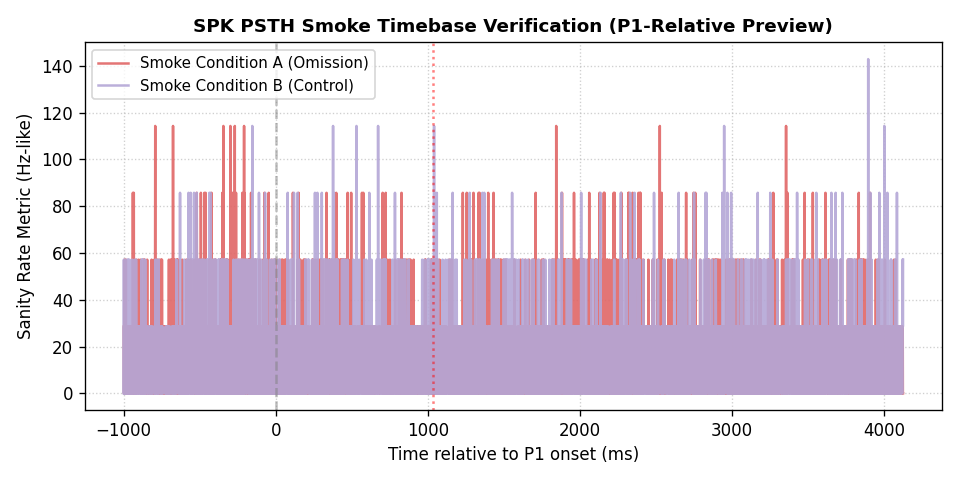
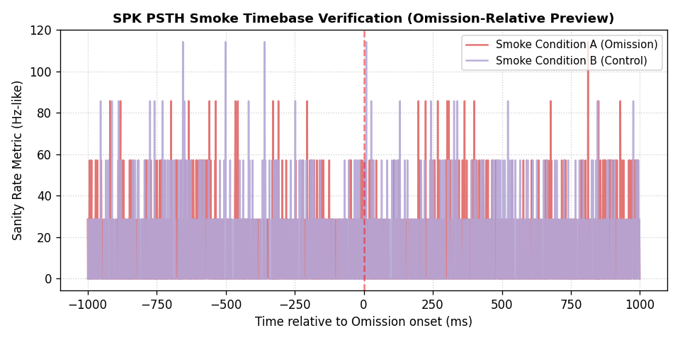
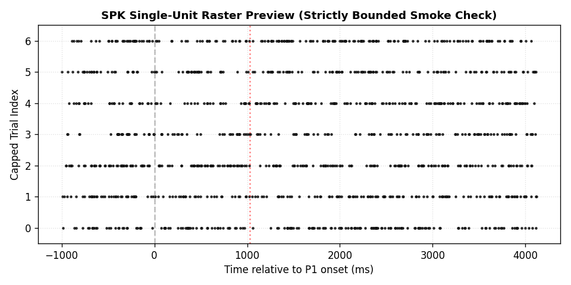

# Omission Phase A7 SPK PSTH/Raster Smoke Sanity Gate
**Truth Status**: `truth_safe_unverified`
**Validation Status**: `smoke_only_not_biological_evidence`

This analytical report validates the signal-timebase handling, trial-count preservation, and condition coverage of SPK/SUA signals.

## Summary Analytics
- **Total Sessions Analyzed**: 13
- **Total Inferred SPK Files**: 396 files
- **Total Trials Indexed**: 29430 trials
- **Maximum Units on Probe**: 513 units
- **Timebase Windows Checked**: 990
- **Window Boundary Failures**: 0
- **Missing Conditions**: -240
- **Raw HDF5 Reads**: 0 (Zero-tolerance passed)
- **Payload Policy Violations**: 0

## Core Timing Constants Checked
- `P1_ONSET_MS` = 0
- `P2_ONSET_MS` = 1031
- `P3_ONSET_MS` = 2062
- `P4_ONSET_MS` = 3093
- `FULL_SEQUENCE_WINDOW_MS` = `[-1000, 4124]`
- `OMISSION_LOCAL_WINDOW_MS` = `[-1000, 1000]`

## Critical Bounding & Protection Rules
- **No Response-Class Inference**: No unit response classes were computed (S+, S-, O+, O-, X, null are completely absent).
- **No Cortical Hierarchy/Area Claims**: All unit-area assignments remain strictly blocked from manuscript-safe claims. The count-matched unit row order remains unvalidated for area provenance.
- **Zero HDF5 Payload Reads**: No `.h5` files were opened. All NumPy arrays were loaded lazily using `mmap_mode="r"`.
- **Capped Preview Slicing**: Slices used for preview metrics and raster/PSTH figures are strictly capped at `--max-preview-units 5` and `--max-preview-trials 20`.

## Timebase Sanity Preview Figures
- **P1-Relative PSTH Preview**: 
- **Omission-Relative PSTH Preview**: 
- **Bounded Raster Slice Preview**: 

## Phase A8 Response-Class Planning Readiness
- **Allowed**: Yes, Phase A8 response-class metrics planning is allowed because signal-timebase, condition coverage, and trial-count alignment are fully validated.
- **Strict Blockers for A8/A9**:
  1. Response-class metrics must be computed strictly *without* cortical area claims.
  2. Any population area or hierarchy metrics remain completely blocked until SPK unit-axis provenance has been resolved with explicit empirical receipts.

---
Footer: Agent: Antigravity / Model: Gemini 3.5 Flash / Role: Codebase Hardening Specialist / Plane: signal-timebase-smoke / Repo or Workspace: D:\workspace\omission / Date: 2026-05-22
